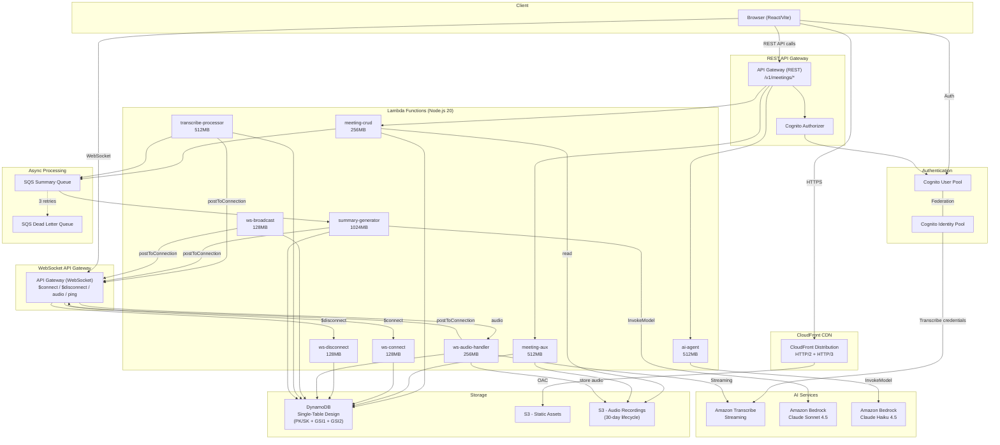
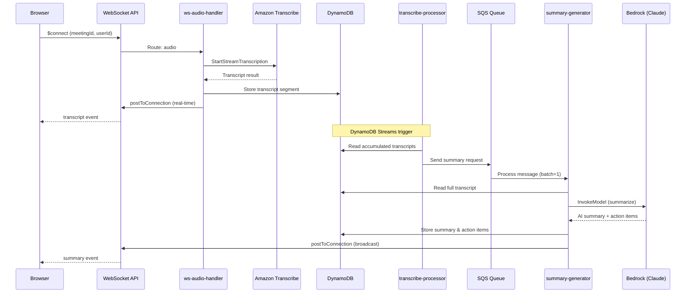
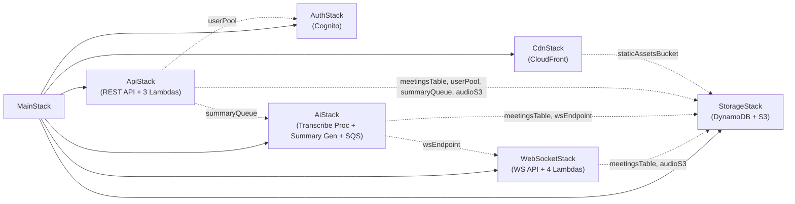
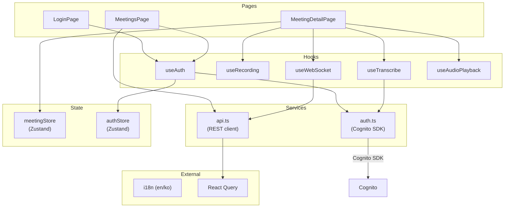

# AWS AI Meeting Notes - Architecture

## System Architecture (High-Level)

## Data Flow (Real-Time Transcription & Summary Pipeline)

## CDK Stack Dependency

## Frontend Component Architecture

## DynamoDB Single-Table Design

| Entity | PK | SK | GSI1PK | GSI1SK |
|--------|----|----|--------|--------|
| Meeting | `MEETING#<id>` | `METADATA` | `USER#<userId>` | `MEETING#<createdAt>` |
| Transcript | `MEETING#<id>` | `TRANSCRIPT#<timestamp>` | `MEETING#<id>` | `TRANSCRIPT#<timestamp>` |
| Summary | `MEETING#<id>` | `SUMMARY#<id>` | `MEETING#<id>` | `SUMMARY#<createdAt>` |
| Action Item | `MEETING#<id>` | `ACTION_ITEM#<id>` | `MEETING#<id>` | `ACTION_ITEM#<createdAt>` |
| Connection | `CONNECTION#<id>` | `METADATA` | `MEETING#<meetingId>` | `CONNECTION#<id>` |
| User | `USER#<id>` | `METADATA` | - | - |

## AWS Services Summary

| Service | Purpose |
|---------|---------|
| Cognito | User auth (User Pool) + Transcribe access (Identity Pool) |
| API Gateway (REST) | Meeting CRUD, AI agent, auxiliary endpoints |
| API Gateway (WebSocket) | Real-time audio streaming + broadcast |
| Lambda (x9) | meeting-crud, meeting-aux, ai-agent, ws-connect, ws-disconnect, ws-audio-handler, ws-broadcast, transcribe-processor, summary-generator |
| DynamoDB | Single-table with Streams, GSI1, GSI2, TTL |
| S3 (x2) | Static assets (frontend) + Audio recordings (30-day lifecycle) |
| CloudFront | CDN with OAC, HTTP/2+3, SPA error handling |
| Amazon Transcribe | Real-time speech-to-text streaming |
| Amazon Bedrock | Claude Sonnet 4.5 (summary) + Claude Haiku 4.5 (agent) |
| SQS + DLQ | Async summary processing with 3 retries |