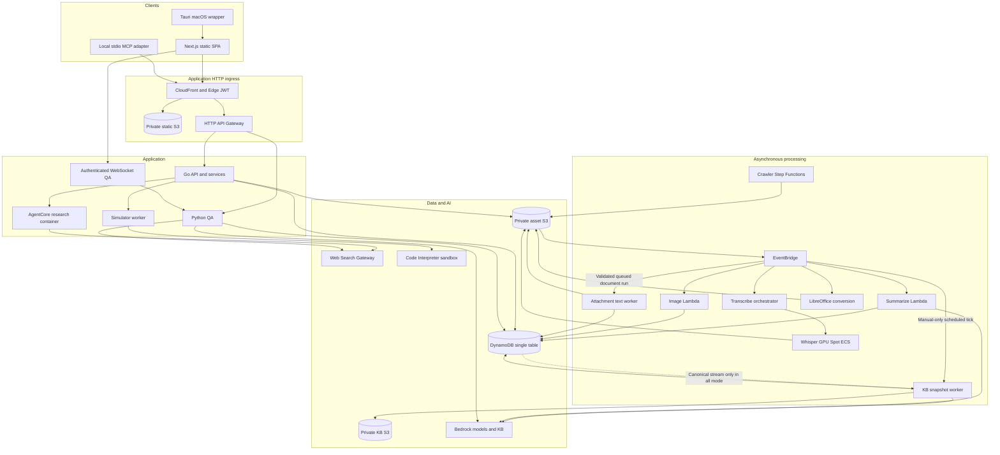

# Architecture

Current component map for the checked-in project. Deployment state requires
independent verification; [infrastructure](INFRA-SPEC.md) records declared gaps.

The diagram groups responsibilities; it is not an exhaustive network-policy
model. Browsers also use authenticated Cognito/Transcribe SDK calls and signed S3
PUTs. Native finished audio uploads stream directly from disk in Rust; live PCM
crosses IPC for captions. The public-document route is the single intentional
unauthenticated application GET and still validates a revocable share token.
Extraction's event target and worker exist, but API producers/consumers remain
staged. The KB schedule is enabled in the app's manual-only configuration;
the dotted canonical stream is created only in all mode. These are repository
capabilities and configuration, not assertions about deployed activation.

## Data paths

1. Capture microphone/tab/native system audio. Live captions use browser Transcribe
   Streaming, with guarded fallback/recovery that prioritizes preserving recording.
2. Upload audio to S3. EventBridge invokes the transcribe orchestrator, which uses
   configured Whisper ECS or AWS Transcribe fallback. Multipart completion and
   transcript uploads trigger summarization with concurrency/retry guards.
3. Refine text while preserving acoustic speakers; summarize the selected source,
   saved notes and supported context into editable meeting content. Transcript
   spill objects are rehydrated by repository reads. Stale segments must not
   override selected/edited A/B text. Conditional snapshot writers publish unique
   immutable spill references only with the matching item update; ambiguous
   writes retain new objects. Reader compatibility precedes writer deployment.
   Saved notes remain separately attributed evidence and cannot fabricate speech
   timestamps, decisions or assigned tasks.
4. Derive account/project material using explicit relations and current access.
   Hierarchy classifies accounts; it never grants membership. Project lists union
   owner, direct membership and linked-account access.
5. Personal documents support independent account copies, read-only email
   references, PDF preview sidecars and token-revocable public links. These paths
   have different storage/access semantics and must not share meeting share keys.
6. QA retrieves candidates, then rechecks current authorized meeting content.
   Research and QA can call an external search provider. Simulator code runs under
   an empty interpreter role plus SANDBOX networking and receives validated
   requirements/options, not the raw transcript.

## New processing and reading contracts

Action-item analysis has its own MEETING#/ANALYSIS#actionItems state. The summary
pipeline runs it inline; authorized editor retries send ActionItemsRequested to
the same summarize Lambda. Run/source/prior-item checks publish items and success
together, preserving unchanged IDs/completion and prior results on failure.
An empty array alone never establishes successful analysis.

The authenticated `/api/meetings/{id}/reading` route bounds JSON before Lambda
serialization. Notes, summary and action sections use metadata views; transcript
reads hydrate only the authorized chosen source and eligible segments. Every page
revalidates access/revision. The MCP adapter passes these pages through with its
own byte ceiling; it no longer fetches full meeting detail for reading.

Attachment extraction supports bounded native text from PDF/PPTX/DOCX/Markdown.
Canonical ATTACH#/ATTEXT# identities, run/lease and ETag checks bind immutable
result JSON. Partial/failed attempts remain distinct from retained previous
results; document locations never imply audio times. Go queue/read services,
the isolated Python worker and QA reader helpers exist; API upload/retry wiring
and summary/QA integration remain staged.

Canonical indexing can project saved meetings and personal/account documents
into immutable canonical/v1/ objects, using current source revisions and pinned
binary/preview bindings. Current manual-only scheduling instead bootstraps private
and authenticated-shared original files into manual-kb/v1/ and shared-kb/v1/
snapshots. Full S3 sync, per-document status and fresh conditional source checks
establish success. Originals and canonical/legacy meeting exports remain unchanged
in bootstrap mode.

Strict current-source QA and tool-history helpers are not imported by the active
handler. Their contract requires fresh authorized reads, current-bound binary
snapshots, explicit partial/pending provenance, and whole-history invalidation
after any stale/denied/untracked dependency. Read-only fingerprints permit checked
continuity; research creation receipts never replay a mutation. Verify snapshots
and recall, deploy strict QA, then enable canonical all-mode delivery.

## Boundaries and ownership

Go layering is handler to service to repository; Go model files own entity keys.
Conditional field updates and transactional relation changes protect concurrency.
Python artifacts deploy independently and repeat selected SigV4 and worker guards
by design. Go chi payload 1.0 and Python QA payload 2.0 are intentional.

Eleven CDK stacks own infrastructure; the exact dependency graph is
`infra/bin/infra.ts`. WebSearchGateway and EdgeAuth are cross-region us-east-1
stacks. KnowledgeStack includes staged undeployed changes, so deploy only explicitly
selected stacks with --exclusively. Public AOSS policy, optional origin verification
and unswept QA TTL fields are documented discrepancies, not claims of compliance.

## References

- [Project constraints and accepted limits](../CLAUDE.md)
- [API contracts](API-SPEC.md)
- [Infrastructure](INFRA-SPEC.md)
- [UI behavior](DESIGN-SPEC.md)
- [Index source/provider contract](../backend/internal/service/INDEX_SOURCE_CONTRACT.md)
- [Extraction worker](../backend/python/document-extract/LAMBDA.md)
- [QA sources](../backend/python/qa/SOURCE_CONTRACT.md),
  [tool history](../backend/python/qa/TOOL_HISTORY_CONTRACT.md),
  [strict account reads](../backend/python/qa/ACCOUNT_READS_CONTRACT.md)
- [Index bootstrap](runbooks/knowledge-index-bootstrap.md),
  [QA cutover](runbooks/qa-current-source-rollout.md)
- [Documentation and ADR navigation](README.md)
- [Deployment](runbooks/deployment.md), [STT recovery](runbooks/stt-pipeline-troubleshooting.md)
- [PR review](runbooks/pr-review.md)
