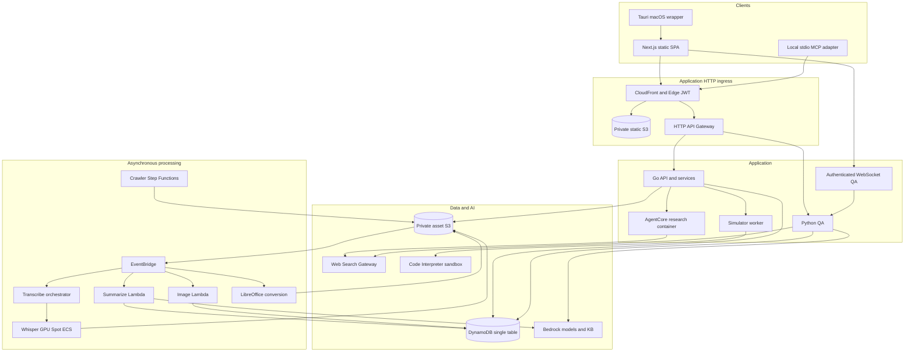

# Architecture

Current component map for the checked-in project. Deployment state requires
independent verification; [infrastructure](INFRA-SPEC.md) records declared gaps.

The diagram groups responsibilities; it is not an exhaustive network-policy
model. Browsers also use authenticated Cognito/Transcribe SDK calls and signed S3
PUTs. Native finished audio uploads stream directly from disk in Rust; live PCM
crosses IPC for captions. The public-document route is the single intentional
unauthenticated application GET and still validates a revocable share token.

## Data paths

1. Capture microphone/tab/native system audio. Live captions use browser Transcribe
   Streaming, with guarded fallback/recovery that prioritizes preserving recording.
2. Upload audio to S3. EventBridge invokes the transcribe orchestrator, which uses
   configured Whisper ECS or AWS Transcribe fallback. Multipart completion and
   transcript uploads trigger summarization with concurrency/retry guards.
3. Refine text while preserving acoustic speakers; summarize the selected source,
   saved notes and supported context into editable meeting content. Transcript
   spill objects are rehydrated by repository reads. Stale segments must not
   override selected/edited A/B text.
4. Derive account/project material using explicit relations and current access.
   Hierarchy classifies accounts; it never grants membership. Project lists union
   owner, direct membership and linked-account access.
5. Personal documents support independent account copies, read-only email
   references, PDF preview sidecars and token-revocable public links. These paths
   have different storage/access semantics and must not share meeting share keys.
6. QA retrieves candidates, then rechecks current authorized meeting content.
   Research and QA can call an external search provider. Simulator code runs under
   an empty interpreter role plus SANDBOX networking and receives validated
   requirements/options, not the raw transcript.

## Boundaries and ownership

Go layering is handler to service to repository; Go model files own entity keys.
Conditional field updates and transactional relation changes protect concurrency.
Python artifacts deploy independently and repeat selected SigV4 and worker guards
by design. Go chi payload 1.0 and Python QA payload 2.0 are intentional.

Eleven CDK stacks own infrastructure; the exact dependency graph is
`infra/bin/infra.ts`. WebSearchGateway and EdgeAuth are cross-region us-east-1
stacks. KnowledgeStack includes staged undeployed changes, so deploy only explicitly
selected stacks with --exclusively. Public AOSS policy, optional origin verification
and unswept QA TTL fields are documented discrepancies, not claims of compliance.

## References

- [Project constraints and accepted limits](../CLAUDE.md)
- [API contracts](API-SPEC.md)
- [Infrastructure](INFRA-SPEC.md)
- [UI behavior](DESIGN-SPEC.md)
- [Documentation and ADR navigation](README.md)
- [Deployment](runbooks/deployment.md), [STT recovery](runbooks/stt-pipeline-troubleshooting.md)
- [PR review](runbooks/pr-review.md)
