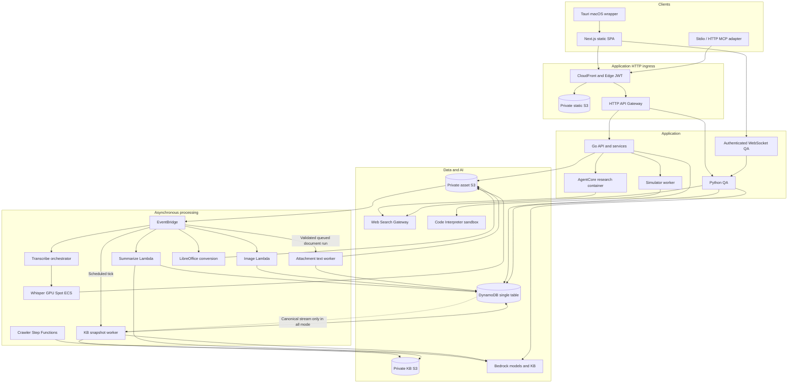

# Architecture

Current component map for the checked-in project. Deployment state requires
independent verification; [infrastructure](INFRA-SPEC.md) records declared gaps.

The diagram groups responsibilities; it is not an exhaustive network-policy
model. Browsers also use authenticated Cognito/Transcribe SDK calls and signed S3
PUTs. Native finished audio uploads stream directly from disk in Rust; live PCM
crosses IPC for captions. The public-document route is the single intentional
unauthenticated application GET and still validates a revocable share token.
Extraction's event target/worker, API producers and summary consumer are wired;
QA/UI activation remains separate. The KB activation configuration retains the
enabled schedule and selects `all`, which adds the dotted canonical stream.
These are repository capabilities and configuration, not assertions about
deployed activation or completed public acceptance.

## Identity onboarding

Cognito identity, the app PROFILE and resource membership are separate states.
The authenticated session bootstrap coordinates profile creation and eligible
pending grants without relying on a meeting-page visit. Project invitations have
a separate user queue plus a project reverse row, keeping older API readers from
consuming unknown grant kinds. Transactions bind project ownership, invitation
version/expiry and recipient sub before publishing membership. JWT email
verification remains required; account roles and global admin rights are never
inherited from a project invitation. See ADR-044 and API-SPEC for contracts.

Deploy and verify the API with `/api/session/bootstrap` and project pending routes
before publishing the new frontend. The new frontend requires bootstrap and will
show retry on an older/missing API. For incompatible API rollback, pause the persistent transactional control row
and drain/cancel project invitations with `prepare-project-invite-rollback`.
Do not retain a project grant across an API version that cannot retire it on
membership changes. The guard must ship before the companion frontend is activated.
Existing account/meeting queue behavior and the project deletion residual storage
race described in ADR-025 remain: deleted projects cannot materialize grants and
unconsumed project invitation rows expire through their existing TTL field.

## Data paths

1. Capture microphone/tab/native system audio. Live captions use browser Transcribe
   Streaming, with guarded fallback/recovery that prioritizes preserving recording.
2. Upload audio to S3. EventBridge invokes the transcribe orchestrator, which uses
   configured Whisper ECS or AWS Transcribe fallback. Multipart completion and
   transcript uploads trigger summarization with concurrency/retry guards.
   Browser chunks also have account-scoped IndexedDB recovery with exclusive
   per-recording Web Locks; a local finalization can defer upload until the next
   visit. Server recovery remains available for expired empty drafts.
3. Refine text while preserving acoustic speakers; summarize the selected source,
   saved notes and supported context into editable meeting content. Transcript
   spill objects are rehydrated by repository reads. Stale segments must not
   override selected/edited A/B text. Conditional snapshot writers publish unique
   immutable spill references only with the matching item update; ambiguous
   writes retain new objects. Reader compatibility precedes writer deployment.
   Saved notes remain separately attributed evidence and cannot fabricate speech
   timestamps, decisions or assigned tasks.
   Final notes use the GPT-6 Sol summary override. Both providers retain bounded
   continuation after token exhaustion and publish only complete visible text.
   Refinement and auxiliary calls keep their independent model selection.
4. Derive account/project material using explicit relations and current access.
   Hierarchy classifies accounts; it never grants membership. Project lists union
   owner, direct membership and linked-account access.
5. Personal documents support independent account copies, read-only email
   references, PDF preview sidecars and token-revocable public links. These paths
   have different storage/access semantics and must not share meeting share keys.
6. QA retrieves candidates, then rechecks current authorized meeting content.
   Research and QA can call an external search provider. Simulator code runs under
   an empty interpreter role plus SANDBOX networking and receives validated
   requirements/options, not the raw transcript.

The SA workflow connects private preparation documents, initial meeting notes,
authorized reference catalogues, and private follow-up snapshots through existing
APIs. Reference selection never searches or publishes automatically; copied notes
are visible to meeting readers. Recording and detail editors compare note text
and server revisions; audio retry is independent of an acknowledged note save.
Account classification and team publication remain separate. Account meeting and
insight projections recheck current canonical publication with strong metadata
reads before returning stored excerpts. See [workflow](features/sa-meeting-workflow.md).

## New processing and reading contracts

Action-item analysis has its own MEETING#/ANALYSIS#actionItems state. The summary
pipeline runs it inline; authorized editor retries send ActionItemsRequested to
the same summarize Lambda. Run/source/prior-item checks publish items and success
together, preserving unchanged IDs/completion and prior results on failure.
An empty array alone never establishes successful analysis.

The authenticated `/api/meetings/{id}/reading` route bounds JSON before Lambda
serialization. Notes, summary and action sections use metadata views; transcript
reads hydrate only the authorized chosen source and eligible segments. Every page
revalidates access/revision. The MCP adapter passes these pages through with its
own byte ceiling; it no longer fetches full meeting detail for reading.
The installed adapter also provides stateless, authenticated HTTP with caller-supplied
file bytes. Remote hosting and OAuth client acceptance remain separate from code
readiness; see [ADR-045](decisions/ADR-045-dual-mcp-transports.md).
Stdio alone can record the Mac microphone through a local ffmpeg child and upload
the audio as a new meeting using the existing meeting, presign and upload-complete APIs.

Attachment extraction supports bounded native text from PDF/PPTX/DOCX/Markdown.
Canonical ATTACH#/ATTEXT# identities, run/lease and ETag checks bind immutable
result JSON. Partial/failed attempts remain distinct from retained previous
results; document locations never imply audio times. Go queue/read services,
the isolated Python worker and QA readers exist. Upload/retry/status/text routes,
verified DOCUMENT summary input and authenticated QA consumption are wired.

Canonical indexing can project saved meetings and personal/account documents
into immutable canonical/v1/ objects, using current source revisions and pinned
binary/preview bindings. The activation configuration selects all-mode delivery;
the earlier manual-only bootstrap produces private and authenticated-shared
snapshots under manual-kb/v1/ and shared-kb/v1/. Full S3 sync, per-document status
and fresh conditional source checks establish success. Bootstrap preserves
originals and canonical/legacy meeting exports. The all-mode index worker preserves
originals, stages canonical projections and removes obsolete legacy exports during
projection/lifecycle cleanup. Provider confirmation follows ingestion and
per-document checks.

Strict current-source QA and tool-history helpers are registered by the active
handler in REST and streaming paths. Their contract requires fresh authorized
reads, current-bound binary snapshots, explicit partial/pending provenance, and
whole-history invalidation after any stale/denied/untracked dependency. Read-only
fingerprints permit checked continuity; research creation receipts never replay
a mutation. The
[bootstrap](runbooks/knowledge-index-bootstrap.md) and
[QA rollout](runbooks/qa-current-source-rollout.md) runbooks track deployed
readiness and outstanding public answer/history acceptance. Complete those gates
before deploying canonical all-mode delivery.

## Boundaries and ownership

Go layering is handler to service to repository; Go model files own entity keys.
Conditional field updates and transactional relation changes protect concurrency.
Python artifacts deploy independently and repeat selected SigV4 and worker guards
by design. Go chi payload 1.0 and Python QA payload 2.0 are intentional.

Eleven CDK stacks own infrastructure; the exact dependency graph is
`infra/bin/infra.ts`. WebSearchGateway and EdgeAuth are cross-region us-east-1
stacks. KnowledgeStack includes staged undeployed changes, so deploy only explicitly
selected stacks with --exclusively. Public AOSS policy, optional origin verification
and unswept QA TTL fields are documented discrepancies, not claims of compliance.

## References

- [Project constraints and accepted limits](../CLAUDE.md)
- [API contracts](API-SPEC.md)
- [Infrastructure](INFRA-SPEC.md)
- [UI behavior](DESIGN-SPEC.md)
- [Index source/provider contract](../backend/internal/service/INDEX_SOURCE_CONTRACT.md)
- [Extraction worker](../backend/python/document-extract/LAMBDA.md)
- [QA sources](../backend/python/qa/SOURCE_CONTRACT.md),
  [tool history](../backend/python/qa/TOOL_HISTORY_CONTRACT.md),
  [strict account reads](../backend/python/qa/ACCOUNT_READS_CONTRACT.md)
- [Index bootstrap](runbooks/knowledge-index-bootstrap.md),
  [QA cutover](runbooks/qa-current-source-rollout.md)
- [Documentation and ADR navigation](README.md)
- [Deployment](runbooks/deployment.md), [STT recovery](runbooks/stt-pipeline-troubleshooting.md)
- [PR review](runbooks/pr-review.md)
- [Batch summary CAS/retries](decisions/ADR-040-guarded-summary-publication.md)
