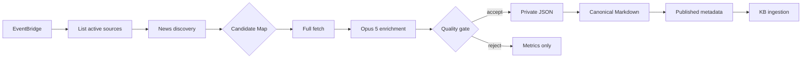

# Knowledge-Grade News Implementation Plan

**Status (2026-09-11):** Preserved implementation plan. This document describes proposed work; committing it does not mark any task complete or deploy the pipeline.

**Before execution:** Reconcile the historical design revision below with the current design document. Allocate an unused ADR number: this plan's proposed `ADR-030` filename conflicts with the existing mobile-caption decision and is not reserved.

> **For agentic workers:** REQUIRED SUB-SKILL: Use superpowers:subagent-driven-development (recommended) or superpowers:executing-plans to implement this plan task-by-task. Steps use checkbox (`- [ ]`) syntax for tracking.

**Goal:** Replace snippet-grade news insights with a durable pipeline that publishes only fully fetched, evidence-backed, self-contained Opus 5 syntheses.

**Architecture:** Keep AgentCore Web Search as discovery, then fan out candidates through a separate full-fetch/enrichment worker. Pure Python modules own URL normalization, article extraction, structured-output validation, and Markdown rendering; Lambda handlers only coordinate AWS calls. Accepted JSON is stored privately in the assets bucket, canonical Markdown is stored in the KB bucket, and DynamoDB metadata is published last so incomplete work remains invisible.

**Tech Stack:** Python 3.12 stdlib + boto3, AWS Step Functions Standard, Lambda ARM64, DynamoDB, S3, Bedrock Claude Opus 5 in `us-west-2`, AgentCore Web Search in `us-east-1`, Go 1.24 Lambda API, Next.js 16, React 19, TypeScript, Tailwind CSS v4, CDK TypeScript

**Approved design:** commit `8e86b39`, `docs/superpowers/specs/2026-08-07-knowledge-enrichment-pipeline-design.md`

---

## File Structure

### New Python units

| File | Responsibility |
|---|---|
| `backend/python/crawler/news_pipeline.py` | Candidate contract, query expansion, URL canonicalization, freshness, exact dedup identity, near-duplicate grouping |
| `backend/python/crawler/article_fetcher.py` | SSRF-safe redirects, bounded HTTP reads, retry policy, HTML normalization, paywall/JS-shell/body-quality rejection |
| `backend/python/crawler/news_enrichment.py` | Opus 5 prompt, response parsing, one repair, evidence and numeric-claim quality gate, token/cost calculation |
| `backend/python/crawler/news_renderer.py` | Deterministic canonical Markdown from an accepted enrichment object |
| `backend/python/crawler/news_discovery.py` | Discovery Lambda handler, monthly-budget precheck, AgentCore searches, candidate cap |
| `backend/python/crawler/news_worker.py` | Candidate Lambda handler, full fetch, claim, enrichment, idempotent S3/DynamoDB publication |
| `backend/python/crawler/news_finalize.py` | Per-source result aggregation, crawl history, monthly estimated cost, budget pause |
| `backend/python/crawler/crawler_metrics.py` | CloudWatch EMF serialization without article bodies or plaintext queries |
| `backend/python/crawler/test_news_pipeline.py` | Focused unit and handler tests for all Phase 1 Python units |

### Modified boundaries

| File | Change |
|---|---|
| `backend/python/crawler/news_crawler.py` | Retain the deliberately separate AgentCore SigV4 client and untrusted-text sanitizer; remove snippet summarization/publication ownership |
| `backend/python/crawler/orchestrator.py` | Pass aliases and run metadata; keep `budget-paused` sources eligible for next-month recovery |
| `backend/python/crawler/ingest_trigger.py` | Preserve result aggregation and expose updated totals |
| `backend/python/crawler/test_crawlers.py` | Remove superseded monolith tests and load the focused news suite |
| `backend/internal/model/meeting.go` | Add source aliases and knowledge-grade metadata projections |
| `backend/internal/model/request.go` | Add optional alias fields and extended crawl-history response fields |
| `backend/internal/repository/crawler.go` | Include alias unions in conditional partial updates |
| `backend/internal/service/crawler.go` | Merge aliases safely across subscriptions |
| `backend/internal/service/insights.go` | Hide legacy news, expose new metadata, delete private artifacts |
| `backend/cmd/api/main.go` | Give `InsightsService` both the KB and assets bucket names |
| `frontend/src/types/meeting.ts` | Mirror new metadata and history counters |
| `frontend/src/lib/api.ts` | Carry alias settings and typed detail responses |
| `frontend/src/components/CrawlerSettings.tsx` | Allow public aliases to be curated |
| `frontend/src/components/InsightsList.tsx` | Render substantive summaries, facts, source count, freshness, and relevance |
| `frontend/src/components/InsightsTableView.tsx` | Add knowledge-grade/source-count columns without clipping |
| `frontend/src/app/insights/[sourceId]/[docHash]/InsightDetailClient.tsx` | Render canonical article content directly; remove raw-excerpt dependence for schema v1 |
| `frontend/src/components/markdown/MermaidBlock.tsx` | Add theme-aware rendering and stable zoom/copy/fullscreen controls |
| `infra/lib/crawler-stack.ts` | Split news discovery/worker/finalizer Lambdas and nested Map workflow; add retries, logging, alarms, schedule DLQ |
| `infra/lib/ai-stack.ts` | Scope assets-prefix and `us.anthropic.claude-opus-5` permissions |
| `infra/bin/infra.ts` | Pass the assets bucket to `CrawlerStack` |
| `infra/test/crawler-stack.test.ts` | Assert workflow, env, retries, DLQ, alarms, and private artifact wiring |
| `scripts/insights-migrate-v1.py` | Dry-run inventory and resumable legacy refetch/delete migration |
| `docs/decisions/ADR-030-knowledge-grade-news-pipeline.md` | Record the implemented Phase 1 decision |
| `docs/architecture.md` | Add Mermaid component and data-flow diagrams |
| `docs/INFRA-SPEC.md` | Document Lambdas, state machine, IAM, metrics, budgets, and recovery behavior |
| `docs/API-SPEC.md` | Document additive crawler and insight fields |
| `docs/runbooks/knowledge-grade-news-rollout.md` | Canary, migration, rollback, and KB reconciliation procedure |

## Fixed Phase 1 Contracts

Candidate workers receive no search snippet and no plaintext search query:

```json
{
  "runId": "2026-08-09T00:00:00Z#wooribank",
  "candidateId": "4b8f15c9c6df0ab4c950c3d7",
  "kind": "news",
  "sourceId": "wooribank",
  "sourceName": "우리은행",
  "aliases": ["Woori Bank"],
  "keywords": ["AI", "클라우드"],
  "title": "우리은행, 생성형 AI 플랫폼 확대",
  "url": "https://publisher.example/article",
  "canonicalUrl": "https://publisher.example/article",
  "publishedAt": "2026-08-08T09:00:00Z",
  "discoveredAt": "2026-08-09T00:00:00Z",
  "queryClass": "investment",
  "searchResultRank": 2,
  "ingestSource": "search",
  "requireRelevance": true,
  "corroboratingSources": []
}
```

Worker results are bounded and contain no body or generated article:

```json
{
  "status": "PUBLISHED",
  "sourceId": "wooribank",
  "docHash": "d5ce8df1ad64f341",
  "reason": "",
  "docsAdded": 1,
  "docsUpdated": 0,
  "estimatedCostUsd": 0.0834,
  "inputTokens": 6940,
  "outputTokens": 1948
}
```

Terminal candidate statuses are `PUBLISHED`, `DUPLICATE`, `FETCH_REJECTED`,
`RELEVANCE_REJECTED`, `QUALITY_REJECTED`, and `ERROR`. Reason values are bounded
codes such as `PAYWALL`, `BODY_TOO_SHORT`, `SCHEMA_INVALID`, and
`EVIDENCE_NOT_FOUND`; exception strings and article text never enter Step Functions
output.

---

### Task 0: Reconcile the Approved Design and Create an Isolated Branch

**Files:**
- Add from approved commit: `docs/superpowers/specs/2026-08-07-knowledge-enrichment-pipeline-design.md`
- Add: `docs/superpowers/plans/2026-08-09-knowledge-grade-news.md`

- [ ] **Step 1: Create an isolated worktree**

Use `superpowers:using-git-worktrees` before editing. Base it on the latest `main`
and name the branch `feat/knowledge-grade-news`.

- [ ] **Step 2: Bring in the approved design**

```bash
git merge-base --is-ancestor 8e86b39 HEAD || git cherry-pick 8e86b39
```

Expected: the design document exists in the worktree. A cherry-pick conflict is
resolved only in the design-document path; unrelated `main` changes are preserved.

- [ ] **Step 3: Verify the planning baseline**

```bash
test -f docs/superpowers/specs/2026-08-07-knowledge-enrichment-pipeline-design.md
test -f docs/superpowers/plans/2026-08-09-knowledge-grade-news.md
git status --short
```

Expected: both documents exist and there are no unrelated worktree changes.

- [ ] **Step 4: Commit the plan when it is not already committed**

```bash
git add docs/superpowers/plans/2026-08-09-knowledge-grade-news.md
git commit -m "docs: plan knowledge-grade news implementation"
```

---

### Task 1: Candidate Contract, Query Expansion, and Canonical Deduplication

**Files:**
- Create: `backend/python/crawler/news_pipeline.py`
- Create: `backend/python/crawler/test_news_pipeline.py`
- Modify: `backend/python/crawler/test_crawlers.py`

- [ ] **Step 1: Write failing pure-function tests**

Add tests covering tracking-parameter removal, query-class expansion, seven-day
freshness, 30-day fallback, exact URL deduplication, event grouping, and custom URL
relevance bypass:

```python
class TestCandidateDiscovery(unittest.TestCase):
    def test_canonicalize_url_removes_tracking_and_sorts_query(self):
        got = news_pipeline.canonicalize_url(
            "HTTPS://Example.COM:443/a?utm_source=x&id=7&b=2#top")
        self.assertEqual(got, "https://example.com/a?b=2&id=7")

    def test_query_expansion_uses_only_public_config(self):
        queries = news_pipeline.expand_queries(
            source_name="우리은행",
            aliases=["Woori Bank"],
            keywords=["AI"],
            after_date=date(2026, 8, 2),
        )
        query_text = "\n".join(q.text for q in queries)
        self.assertIn('"우리은행"', query_text)
        self.assertIn('"Woori Bank"', query_text)
        self.assertIn("after:2026-08-02", query_text)
        self.assertNotIn("meeting", query_text.lower())
        self.assertLessEqual(len(queries), news_pipeline.MAX_QUERIES_PER_SOURCE)

    def test_near_duplicates_become_one_event_group(self):
        grouped = news_pipeline.group_near_duplicates([
            candidate("우리은행 AI 플랫폼 확대", "https://a.example/1", "2026-08-08"),
            candidate("우리은행 AI 플랫폼 확대 발표", "https://b.example/2", "2026-08-09"),
        ])
        self.assertEqual(len(grouped), 1)
        self.assertEqual(len(grouped[0]["corroboratingSources"]), 1)

    def test_custom_url_bypasses_only_relevance(self):
        item = news_pipeline.custom_url_candidate(
            source_id="woori", source_name="우리은행",
            url="https://example.com/curated", run_id="run-1")
        self.assertFalse(item["requireRelevance"])
        self.assertEqual(item["ingestSource"], "custom")
```

Use a local `candidate()` fixture that supplies fixed dates and source identity so
the grouping test has no wall-clock dependency.

- [ ] **Step 2: Run the focused suite and confirm failure**

```bash
cd backend/python/crawler
python3 -m unittest test_news_pipeline.TestCandidateDiscovery -v
```

Expected: FAIL because `news_pipeline` does not exist.

- [ ] **Step 3: Implement the pure candidate module**

Implement `canonicalize_url`, `document_hash`, `expand_queries`,
`parse_published_at`, `is_within_days`, `group_near_duplicates`, and
`custom_url_candidate`. Lock constants and the query value object as:

```python
MAX_QUERIES_PER_SOURCE = 12
TRACKING_PARAMS = {"gclid", "fbclid", "msclkid"}

@dataclass(frozen=True)
class SearchQuery:
    query_class: str
    text: str
```

`canonicalize_url` accepts only HTTP(S), lowercases scheme/host, removes fragments
and default ports, removes `utm_*` plus `TRACKING_PARAMS`, and sorts retained query
pairs. `group_near_duplicates` requires title-token Jaccard similarity at least
`0.75`, a shared configured organization alias, and publication dates no more than
seven days apart. `eventGroupId` is a SHA-256 over the source ID and sorted canonical
URLs, truncated to 24 hex characters.

- [ ] **Step 4: Load the focused suite from the established command**

Add this to `test_crawlers.py`:

```python
import test_news_pipeline

def load_tests(loader, tests, pattern):
    tests.addTests(loader.loadTestsFromModule(test_news_pipeline))
    return tests
```

Do not copy AgentCore Gateway tests out of `test_crawlers.py`; the crawler's
deliberately separate SigV4 implementation remains covered there.

- [ ] **Step 5: Run the focused and established suites**

```bash
cd backend/python/crawler
python3 -m unittest test_news_pipeline.TestCandidateDiscovery -v
python3 -m unittest test_crawlers -v
```

Expected: PASS.

- [ ] **Step 6: Commit**

```bash
git add backend/python/crawler/news_pipeline.py \
  backend/python/crawler/test_news_pipeline.py \
  backend/python/crawler/test_crawlers.py
git commit -m "feat(crawler): add news discovery contracts"
```

---

### Task 2: Mandatory Full-Body Fetch and Content Quality

**Files:**
- Create: `backend/python/crawler/article_fetcher.py`
- Modify: `backend/python/crawler/test_news_pipeline.py`
- Modify: `backend/python/crawler/news_crawler.py`

- [ ] **Step 1: Write failing fetch-policy tests**

Use fake opener responses; no test performs a real network request:

```python
class TestArticleFetcher(unittest.TestCase):
    def test_rejects_private_redirect(self):
        with mock.patch.object(socket, "getaddrinfo",
                               return_value=addrinfo("10.0.0.8")):
            with self.assertRaises(article_fetcher.FetchRejected) as raised:
                article_fetcher.validate_public_url("https://internal.example/x")
        self.assertEqual(raised.exception.reason, "BLOCKED_HOST")

    def test_rejects_oversized_compressed_body(self):
        response = fake_response(
            b"x" * (article_fetcher.MAX_COMPRESSED_BYTES + 1),
            content_type="text/html")
        with self.assertRaises(article_fetcher.FetchRejected) as raised:
            article_fetcher.fetch_article(
                "https://example.com/a", opener=fake_opener(response),
                resolver=public_resolver)
        self.assertEqual(raised.exception.reason, "BODY_TOO_LARGE")

    def test_rejects_paywall_and_js_shell(self):
        for html, reason in [
            ("<html><p>구독 후 전체 기사를 읽을 수 있습니다</p></html>", "PAYWALL"),
            ("<html><div id='root'></div><script src='app.js'></script></html>", "JS_SHELL"),
        ]:
            with self.subTest(reason=reason):
                with self.assertRaises(article_fetcher.FetchRejected) as raised:
                    article_fetcher.normalize_html(html, "https://example.com/a")
                self.assertEqual(raised.exception.reason, reason)

    def test_requires_800_characters_and_four_blocks(self):
        html = "<article>" + "".join(
            f"<p>{'가' * 220}</p>" for _ in range(4)) + "</article>"
        result = article_fetcher.normalize_html(html, "https://example.com/a")
        self.assertGreaterEqual(len(result.body), 800)
        self.assertEqual(len(result.blocks), 4)
```

Also cover five-redirect maximum, unsupported content types, gzip decoded-size
limit, transient 429/5xx retry, no retry for deterministic 4xx, canonical link
validation, boilerplate removal, and timeout reason mapping.

- [ ] **Step 2: Verify the tests fail**

```bash
cd backend/python/crawler
python3 -m unittest test_news_pipeline.TestArticleFetcher -v
```

Expected: FAIL because `article_fetcher` does not exist.

- [ ] **Step 3: Implement bounded fetching**

Expose the `FetchRejected`, `ArticleBody`, `validate_public_url`,
`normalize_html`, and `fetch_article` interfaces. Define the result and rejection
types exactly as:

```python
class FetchRejected(Exception):
    def __init__(self, reason: str):
        super().__init__(reason)
        self.reason = reason

@dataclass(frozen=True)
class ArticleBody:
    requested_url: str
    final_url: str
    canonical_url: str
    title: str
    published_at: str
    body: str
    blocks: tuple[str, ...]
```

`fetch_article` performs at most three attempts, ten-second connect/read timeout,
exponential backoff with jitter for 429 and 5xx, at most five redirects, a 2 MiB
compressed limit, a 4 MiB decoded limit, and a 30,000-character normalized-body
limit. It accepts `text/html`, `application/xhtml+xml`, and `text/plain`. The HTML
parser collects headings, paragraphs, and list items inside `article`/`main` when
available, then falls back to document content while excluding script, style, nav,
header, footer, aside, forms, cookie dialogs, and repeated blocks.

- [ ] **Step 4: Reuse the existing hardened URL and sanitizer entry points**

Replace the old fetch implementation in `news_crawler.py` with imports/re-exports:

```python
from article_fetcher import (
    ArticleBody,
    FetchRejected,
    fetch_article as _fetch_article,
    validate_public_url,
)

def _fetch_url(url: str, timeout: int = 10) -> str:
    return _fetch_article(url).body
```

Keep `_sigv4_post`, `_gateway_web_search`, `_extract_sse_json`, and
`_sanitize_snippet` in this file. Replace every log containing the literal query
with a 12-character SHA-256 query hash and result count.

Move `TestFetchUrlSSRFGuard` and `TestSSRFSafeRedirectHandler` patch targets from
`news_crawler.socket`/`news_crawler._ssrf_safe_opener` to
`article_fetcher.socket`/`article_fetcher._ssrf_safe_opener`; they now test the
owning module rather than a compatibility wrapper.

- [ ] **Step 5: Run security and fetch tests**

```bash
cd backend/python/crawler
python3 -m unittest \
  test_news_pipeline.TestArticleFetcher \
  test_crawlers.TestFetchUrlSSRFGuard \
  test_crawlers.TestSSRFSafeRedirectHandler -v
```

Expected: PASS.

- [ ] **Step 6: Commit**

```bash
git add backend/python/crawler/article_fetcher.py \
  backend/python/crawler/news_crawler.py \
  backend/python/crawler/test_news_pipeline.py
git commit -m "feat(crawler): require complete article bodies"
```

---

### Task 3: Opus 5 Structured Enrichment and Deterministic Quality Gate

**Files:**
- Create: `backend/python/crawler/news_enrichment.py`
- Modify: `backend/python/crawler/test_news_pipeline.py`

- [ ] **Step 1: Write failing schema and quality tests**

```python
class TestNewsEnrichmentQuality(unittest.TestCase):
    def test_accepts_grounded_knowledge_grade_output(self):
        body = article_body("우리은행은 생성형 AI 플랫폼을 확대했다. " + "가" * 1000)
        raw = valid_enrichment_json(
            executive_summary="핵심 사건과 배경 및 영향을 설명한다. " + "나" * 650,
            evidence_excerpt="우리은행은 생성형 AI 플랫폼을 확대했다.")
        accepted = news_enrichment.validate_enrichment(
            raw, body, require_relevance=True)
        self.assertEqual(accepted["schemaVersion"], 1)
        self.assertGreaterEqual(len(accepted["keyFacts"]), 3)

    def test_rejects_evidence_not_present_in_body(self):
        with self.assertRaises(news_enrichment.QualityRejected) as raised:
            news_enrichment.validate_enrichment(
                valid_enrichment_json(evidence_excerpt="원문에 없는 문장"),
                article_body("가" * 1200), require_relevance=True)
        self.assertEqual(raised.exception.reason, "EVIDENCE_NOT_FOUND")

    def test_rejects_numeric_claim_without_evidence(self):
        raw = valid_enrichment_json()
        raw["keyFacts"][0] = {
            "fact": "투자액은 300억원이다",
            "evidenceIds": [],
            "confidence": 0.9,
        }
        with self.assertRaises(news_enrichment.QualityRejected) as raised:
            news_enrichment.validate_enrichment(
                raw, article_body("투자액은 300억원이다. " + "가" * 1200), True)
        self.assertEqual(raised.exception.reason, "NUMERIC_CLAIM_UNGROUNDED")

    def test_custom_url_does_not_bypass_schema_or_evidence(self):
        with self.assertRaises(news_enrichment.QualityRejected):
            news_enrichment.validate_enrichment(
                {"relevant": False, "relevanceConfidence": 0.1},
                article_body("가" * 1200), require_relevance=False)

    def test_one_repair_then_reject(self):
        bedrock = fake_bedrock_responses("not-json", "still-not-json")
        with self.assertRaises(news_enrichment.QualityRejected) as raised:
            news_enrichment.enrich_article(
                candidate_fixture(), [article_body("가" * 1200)], bedrock)
        self.assertEqual(raised.exception.reason, "SCHEMA_INVALID")
        self.assertEqual(bedrock.call_count, 2)
```

Add cases for summary under 600 characters, fewer than three facts, fewer than two
evidence-backed facts, missing context/impact, fewer than two combined
questions/actions, evidence excerpt over 180 characters, total excerpts over 1,000
characters, non-HTTP source URLs, prompt delimiters in output, and reconstructed
source text.

- [ ] **Step 2: Confirm failure**

```bash
cd backend/python/crawler
python3 -m unittest test_news_pipeline.TestNewsEnrichmentQuality -v
```

Expected: FAIL because `news_enrichment` does not exist.

- [ ] **Step 3: Implement the enrichment boundary**

Expose `build_prompt`, `parse_json_object`, `validate_enrichment`,
`estimate_cost`, and `enrich_article`. Lock the configuration and rejection type:

```python
FINAL_MODEL_REGION = os.environ.get("FINAL_MODEL_REGION", "us-west-2")
FINAL_MODEL_ID = os.environ.get(
    "FINAL_MODEL_ID", "us.anthropic.claude-opus-5")
PROMPT_VERSION = "news-v1"
QUALITY_GATE_VERSION = "news-v1"

class QualityRejected(Exception):
    def __init__(self, reason: str, errors: list[str] | None = None):
        super().__init__(reason)
        self.reason = reason
        self.errors = errors or []
```

The model envelope contains the design schema plus:

```json
{
  "relevant": true,
  "relevanceConfidence": 0.91,
  "relevanceRationale": "기사의 주체가 설정된 고객사와 일치한다"
}
```

The accepted artifact keeps those three fields. Prompt text wraps each fetched body
inside a numbered untrusted-data element after stripping closing delimiter tokens.
Source name, aliases, keywords, titles, and bodies all pass through the existing
untrusted-text sanitizer before interpolation; control characters and overlong
anchor values are rejected or capped before they reach instruction-level text.
The repair request contains the original body, invalid output, and bounded validator
codes; it cannot introduce a third model call. `estimate_cost` uses `$5/1M` input
tokens and `$25/1M` output tokens and returns `Decimal`.

- [ ] **Step 4: Initialize Bedrock in the selected Region**

The worker, not this pure module, creates:

```python
bedrock = boto3.client("bedrock-runtime", region_name=FINAL_MODEL_REGION)
```

`enrich_article` invokes Converse with `modelId=FINAL_MODEL_ID`,
`maxTokens=3000`, and `temperature=0.1`. It returns the accepted artifact and:

```python
{
    "inputTokens": usage.get("inputTokens", 0),
    "outputTokens": usage.get("outputTokens", 0),
    "estimatedCostUsd": str(estimate_cost(usage)),
    "repairCount": repair_count,
}
```

- [ ] **Step 5: Run the enrichment suite**

```bash
cd backend/python/crawler
python3 -m unittest test_news_pipeline.TestNewsEnrichmentQuality -v
```

Expected: PASS with exactly two Bedrock calls in repair cases and one otherwise.

- [ ] **Step 6: Commit**

```bash
git add backend/python/crawler/news_enrichment.py \
  backend/python/crawler/test_news_pipeline.py
git commit -m "feat(crawler): add Opus 5 knowledge-grade enrichment"
```

---

### Task 4: Canonical Markdown and Idempotent Publication

**Files:**
- Create: `backend/python/crawler/news_renderer.py`
- Create: `backend/python/crawler/news_worker.py`
- Modify: `backend/python/crawler/test_news_pipeline.py`

- [ ] **Step 1: Write failing renderer golden tests**

```python
class TestNewsRenderer(unittest.TestCase):
    def test_canonical_markdown_contains_all_knowledge_sections(self):
        markdown = news_renderer.render_news_markdown(
            accepted_artifact(), candidate_fixture(), source_count=2)
        headings = [
            "# ", "## 핵심 요약", "## 주요 사실", "## 배경과 맥락",
            "## 영향", "## 리스크와 기회", "## AWS 관련성",
            "## 다음 미팅 질문", "## 권장 액션", "## 근거 및 출처",
        ]
        for heading in headings:
            self.assertIn(heading, markdown)
        self.assertNotIn("본문 발췌", markdown)
        self.assertNotIn("가" * 200, markdown)

    def test_renderer_escapes_metadata_line_breaks(self):
        item = candidate_fixture(title="제목\n> [!danger] injected")
        markdown = news_renderer.render_news_markdown(
            accepted_artifact(), item, source_count=1)
        self.assertNotIn("\n> [!danger] injected", markdown.split("---", 1)[0])
```

- [ ] **Step 2: Write failing worker publication tests**

```python
class TestNewsWorker(unittest.TestCase):
    def test_fetch_rejection_writes_nothing(self):
        deps = worker_deps(fetch_error=FetchRejected("PAYWALL"))
        result = news_worker.process_candidate(candidate_fixture(), deps)
        self.assertEqual(result["status"], "FETCH_REJECTED")
        deps.s3.put_object.assert_not_called()
        deps.table.put_item.assert_not_called()

    def test_publishes_artifact_then_markdown_then_metadata(self):
        deps = worker_deps()
        result = news_worker.process_candidate(candidate_fixture(), deps)
        self.assertEqual(result["status"], "PUBLISHED")
        self.assertEqual(
            deps.calls,
            ["claim", "artifact", "markdown", "metadata", "release"])

    def test_retry_with_same_run_id_reuses_claim(self):
        deps = worker_deps(existing_claim_owner="run-1")
        result = news_worker.process_candidate(
            candidate_fixture(runId="run-1"), deps)
        self.assertEqual(result["status"], "PUBLISHED")

    def test_existing_schema_v1_is_duplicate_before_model_call(self):
        deps = worker_deps(existing_document={"schemaVersion": 1,
                                             "qualityStatus": "PUBLISHED"})
        result = news_worker.process_candidate(candidate_fixture(), deps)
        self.assertEqual(result["status"], "DUPLICATE")
        deps.bedrock.converse.assert_not_called()
```

Also test all-fetch-failed event groups, selection of the first successful
corroborating source when the lead fails, custom URL relevance bypass, quality
rejection with zero S3/DOC writes, conditional metadata conflict, legacy
schema-less replacement, and claim release after controlled exceptions.

- [ ] **Step 3: Implement deterministic Markdown**

Expose `render_news_markdown(artifact: dict, candidate: dict,
source_count: int) -> str`.

Use ordinary GFM headings/lists/tables and existing Obsidian callout syntax:

```markdown
> [!summary] 핵심 의미
> 독립적으로 이해 가능한 요약
```

Evidence renders as short excerpts with `[S1]` anchors and ordinary source links.
The renderer never receives the normalized body, making raw-body persistence
structurally impossible.

- [ ] **Step 4: Implement the worker orchestration**

Use a dependency container so pure tests do not patch module globals:

```python
@dataclass
class WorkerDeps:
    table: object
    kb_s3: object
    artifact_s3: object
    bedrock: object
    fetch: Callable[[str], ArticleBody]
    now: Callable[[], datetime]
```

Expose `process_candidate(candidate: dict, deps: WorkerDeps) -> dict`; the Lambda
`handler(event, context)` constructs production dependencies and returns that
function's bounded result.

Processing order:

1. Check the candidate URL's `CRAWLER#{sourceId}/DOC#{docHash}` and skip only
   schema-v1 `PUBLISHED`; a DynamoDB read error raises for Step Functions retry.
2. Fetch lead and up to two corroborating URLs; reject when none passes.
3. Recompute canonical URL and `docHash` from the successful fetch's final/canonical
   URL, repeat the published-document check, then claim
   `CRAWLER#{sourceId}/CLAIM#{docHash}` with owner `runId`, 30-minute TTL,
   and condition `attribute_not_exists(PK) OR expiresAt < :now`. The same owner may
   resume a retry.
4. Call Opus and the quality gate.
5. Put private JSON at
   `knowledge-artifacts/news/{sourceId}/{docHash}.json`.
6. Put canonical Markdown at `shared/news/{sourceId}/{docHash}.md`.
7. Put DOC metadata with condition
   `attribute_not_exists(PK) OR attribute_not_exists(schemaVersion)`.
8. Delete the matching claim conditionally.

The accepted JSON contains only structured synthesis and bounded evidence excerpts,
never the fetched bodies. The DOC item includes every field from design section
9.1. `contentHash` is SHA-256 of the normalized primary body, `summary` is capped at
1,500 characters, `keyTakeaways` contains the first three facts, and
`corroboratingSourceCount` counts successful additional sources beyond the lead.

- [ ] **Step 5: Run renderer and worker tests**

```bash
cd backend/python/crawler
python3 -m unittest \
  test_news_pipeline.TestNewsRenderer \
  test_news_pipeline.TestNewsWorker -v
```

Expected: PASS.

- [ ] **Step 6: Commit**

```bash
git add backend/python/crawler/news_renderer.py \
  backend/python/crawler/news_worker.py \
  backend/python/crawler/test_news_pipeline.py
git commit -m "feat(crawler): publish canonical news knowledge"
```

---

### Task 5: Discovery and Finalization Handlers, Metrics, and Cost Limits

**Files:**
- Create: `backend/python/crawler/crawler_metrics.py`
- Create: `backend/python/crawler/news_discovery.py`
- Create: `backend/python/crawler/news_finalize.py`
- Modify: `backend/python/crawler/orchestrator.py`
- Modify: `backend/python/crawler/ingest_trigger.py`
- Modify: `backend/python/crawler/test_news_pipeline.py`
- Modify: `backend/python/crawler/test_crawlers.py`

- [ ] **Step 1: Write failing discovery tests**

```python
class TestNewsDiscoveryHandler(unittest.TestCase):
    def test_search_snippet_is_not_forwarded(self):
        gateway = mock.Mock(return_value=([{
            "title": "기사", "url": "https://example.com/a",
            "text": "검색 snippet", "publishedDate": "2026-08-08",
        }], None))
        result = news_discovery.discover(
            source_event(), gateway=gateway, table=fake_table(), now=fixed_now)
        self.assertNotIn("snippet", json.dumps(result["candidates"]))
        self.assertNotIn("검색 snippet", json.dumps(result["candidates"]))

    def test_uses_30_day_fallback_only_when_7_day_pass_has_no_candidates(self):
        gateway = sequenced_gateway([], [search_result(days_old=20)])
        result = news_discovery.discover(
            source_event(), gateway=gateway, table=fake_table(), now=fixed_now)
        self.assertEqual(result["freshnessDays"], 30)
        self.assertEqual(len(result["candidates"]), 1)

    def test_caps_candidates_by_count_and_run_budget(self):
        result = news_discovery.apply_candidate_budget(
            [candidate_fixture(url=f"https://example.com/{i}") for i in range(100)],
            max_candidates=20, max_run_usd=Decimal("0.50"),
            max_cost_per_candidate=Decimal("0.10"))
        self.assertEqual(len(result), 5)

    def test_monthly_120_percent_budget_stops_before_search(self):
        gateway = mock.Mock()
        result = news_discovery.discover(
            source_event(), gateway=gateway,
            table=fake_table(month_cost="30.01"), now=fixed_now,
            monthly_budget=Decimal("25"))
        self.assertTrue(result["budgetPaused"])
        gateway.assert_not_called()
```

- [ ] **Step 2: Write failing finalizer and metric tests**

```python
class TestNewsFinalize(unittest.TestCase):
    def test_aggregates_bounded_reason_codes_and_cost(self):
        result = news_finalize.finalize(source_result_event([
            worker_result("PUBLISHED", cost="0.08"),
            worker_result("FETCH_REJECTED", reason="PAYWALL"),
        ]), table=fake_table(), emit=mock.Mock(), now=fixed_now)
        self.assertEqual(result["docsAdded"], 1)
        self.assertEqual(result["fetchRejected"], 1)
        self.assertEqual(result["errors"], [])

    def test_emf_contains_no_query_or_article_text(self):
        line = crawler_metrics.serialize_emf(
            stage="fetch", source_id="woori",
            metrics={"FetchRejected": 1}, reason="PAYWALL")
        self.assertNotIn("query", line.lower())
        self.assertNotIn("article", line.lower())
```

- [ ] **Step 3: Confirm failure**

```bash
cd backend/python/crawler
python3 -m unittest \
  test_news_pipeline.TestNewsDiscoveryHandler \
  test_news_pipeline.TestNewsFinalize -v
```

Expected: FAIL because the handlers do not exist.

- [ ] **Step 4: Implement discovery**

`news_discovery.handler`:

- validates required source fields;
- checks `COST#{YYYY-MM}` before search;
- generates seven-day query classes and hashes query text for logs;
- retries the search call only through the Gateway client's bounded transport
  behavior;
- runs a 30-day pass only when the seven-day pass yields zero deterministic
  candidates;
- adds explicit custom URLs without freshness/relevance filtering;
- removes existing schema-v1 published docs with one `BatchGetItem`;
- groups event duplicates;
- applies `min(MAX_CANDIDATES_PER_SOURCE,
  floor(MAX_ESTIMATED_COST_USD_PER_RUN / MAX_COST_PER_ARTICLE_USD))`;
- returns candidates and bounded counters.

`orchestrator.handler` creates one UUID-backed run prefix per invocation and adds
`runId="{runPrefix}#{sourceId}"` to every news-source event. Discovery copies it to
every candidate unchanged, so Step Functions retries of the same candidate resume
the same claim while a genuinely separate workflow cannot take over a live claim.

Defaults:

```python
MAX_CANDIDATES_PER_SOURCE = 20
MAX_ESTIMATED_COST_USD_PER_RUN = Decimal("2.00")
MAX_COST_PER_ARTICLE_USD = Decimal("0.10")
MONTHLY_SOURCE_BUDGET_USD = Decimal("25.00")
```

- [ ] **Step 5: Implement finalization and EMF**

`news_finalize.handler` aggregates worker results, writes the extended `HISTORY#`
item, atomically adds estimated cost and token counts to `COST#{YYYY-MM}`, and sets
CONFIG status to `budget-paused` only after 120% of the monthly source budget. It
sets status back to `active` after a successful new-month run. Every CONFIG update
requires `attribute_exists(PK)` and refuses to overwrite `disabled`.

Emit both global and per-source EMF metrics under `TTOBAK/Crawler` for discovery,
fetch rejection, relevance rejection, quality rejection, publication, model usage,
estimated cost, and budget pause.

- [ ] **Step 6: Preserve ingestion aggregation**

Update `ingest_trigger.py` so `totalDocsUpdated` is returned alongside
`totalDocsAdded`, without changing the rule that ingestion is skipped only when both
are zero.

- [ ] **Step 7: Run handler tests**

```bash
cd backend/python/crawler
python3 -m unittest test_news_pipeline test_crawlers -v
```

Expected: PASS. Logs contain query hashes but no plaintext query strings.

- [ ] **Step 8: Commit**

```bash
git add backend/python/crawler/crawler_metrics.py \
  backend/python/crawler/news_discovery.py \
  backend/python/crawler/news_finalize.py \
  backend/python/crawler/orchestrator.py \
  backend/python/crawler/ingest_trigger.py \
  backend/python/crawler/test_news_pipeline.py \
  backend/python/crawler/test_crawlers.py
git commit -m "feat(crawler): orchestrate bounded news enrichment"
```

---

### Task 6: Step Functions, IAM, Retries, DLQ, and Alarms

**Files:**
- Modify: `infra/lib/crawler-stack.ts`
- Modify: `infra/lib/ai-stack.ts`
- Modify: `infra/bin/infra.ts`
- Modify: `infra/test/crawler-stack.test.ts`

- [ ] **Step 1: Write failing CDK assertions**

Add assertions for six crawler Lambdas, exact handlers, model Region/ID, assets
bucket environment, nested Map states, retry/catch behavior, execution logging with
input excluded, schedule DLQ, and alarms. Extend the assertions import to
`import { Match, Template } from 'aws-cdk-lib/assertions';`, then add:

```typescript
test('creates split knowledge-grade news workers', () => {
  template.resourceCountIs('AWS::Lambda::Function', 6);
  for (const [name, handler] of [
    ['ttobak-crawler-news-discovery', 'news_discovery.handler'],
    ['ttobak-crawler-news-worker', 'news_worker.handler'],
    ['ttobak-crawler-news-finalize', 'news_finalize.handler'],
  ]) {
    template.hasResourceProperties('AWS::Lambda::Function', {
      FunctionName: name,
      Handler: handler,
    });
  }
});

test('worker uses Opus 5 in us-west-2 and private artifact bucket', () => {
  template.hasResourceProperties('AWS::Lambda::Function', {
    FunctionName: 'ttobak-crawler-news-worker',
    Environment: { Variables: Match.objectLike({
      FINAL_MODEL_ID: 'us.anthropic.claude-opus-5',
      FINAL_MODEL_REGION: 'us-west-2',
      ARTIFACT_BUCKET_NAME: Match.anyValue(),
    })},
  });
});

test('schedule has a dead letter queue', () => {
  template.resourceCountIs('AWS::SQS::Queue', 1);
  template.hasResourceProperties('AWS::Events::Rule', {
    Targets: Match.arrayWith([Match.objectLike({
      DeadLetterConfig: { Arn: Match.anyValue() },
    })]),
  });
});
```

Inspect the synthesized state-machine string and assert it contains
`DiscoverNews`, `MapNewsCandidates`, `EnrichNewsCandidate`, `FinalizeNews`,
`Retry`, and `Catch`.

- [ ] **Step 2: Run the focused infra test**

```bash
cd infra
npm test -- --runInBand test/crawler-stack.test.ts
```

Expected: FAIL because only four Lambdas and one news task exist.

- [ ] **Step 3: Add the assets bucket prop and least-privilege grants**

Add `assetsBucket: s3.IBucket` to `CrawlerStackProps` and pass
`storageStack.bucket` from `infra/bin/infra.ts`. In `AiStack`, grant the crawler
role read/write only to `knowledge-artifacts/*` in the assets bucket. Add this
inference-profile ARN to the existing Bedrock statement:

```typescript
`arn:aws:bedrock:us-west-2:${cdk.Aws.ACCOUNT_ID}:inference-profile/us.anthropic.claude-opus-5`
```

Keep existing KB bucket access because technical crawling and canonical Markdown
share the role. Do not alter the out-of-band KnowledgeStack resources.

- [ ] **Step 4: Replace the single news Lambda with three functions**

Use one shared Python asset and define this local helper before creating the three
functions:

```typescript
const crawlerCode = lambda.Code.fromAsset('../backend/python/crawler');
const pythonFunction = (
  constructId: string,
  functionName: string,
  handler: string,
  timeout: cdk.Duration,
  memorySize: number,
  environment: Record<string, string>,
) => new lambda.Function(this, constructId, {
  functionName,
  runtime: lambda.Runtime.PYTHON_3_12,
  architecture: lambda.Architecture.ARM_64,
  handler,
  code: crawlerCode,
  role: props.crawlerRole as iam.Role,
  environment,
  timeout,
  memorySize,
});

const newsDiscovery = pythonFunction(
  'NewsDiscoveryFunction', 'ttobak-crawler-news-discovery',
  'news_discovery.handler', cdk.Duration.minutes(3), 512, discoveryEnv);
const newsWorker = pythonFunction(
  'NewsWorkerFunction', 'ttobak-crawler-news-worker',
  'news_worker.handler', cdk.Duration.minutes(14), 1024, workerEnv);
const newsFinalize = pythonFunction(
  'NewsFinalizeFunction', 'ttobak-crawler-news-finalize',
  'news_finalize.handler', cdk.Duration.minutes(2), 256, finalizeEnv);
```

`workerEnv` contains `FINAL_MODEL_ID`, `FINAL_MODEL_REGION`,
`ARTIFACT_BUCKET_NAME`, `KB_BUCKET_NAME`, `RELEVANCE_THRESHOLD=0.75`, prompt and
gate versions. Discovery/finalize env contains the run/monthly budget values.

- [ ] **Step 5: Build the nested per-source workflow**

The outer `MapNewsSources` keeps `maxConcurrency: 3`. Its item processor is:

```text
DiscoverNews
  -> MapNewsCandidates(maxConcurrency: 5)
       -> EnrichNewsCandidate
          Retry: Lambda service errors, throttling, timeout; 3 attempts, backoff 2
          Catch: bounded ERROR result
  -> FinalizeNews
```

Use `resultPath` so the source config, discovery result, and article results are
available to the finalizer. Discovery/finalizer task failures retry three times and
then return a source-level ERROR result, allowing unrelated outer-map items to
continue. The final news branch output remains a list of
`{docsAdded, docsUpdated, errors}` objects so `ingest_trigger.py` stays compatible.

- [ ] **Step 6: Add workflow logging, delivery DLQ, and alarms**

Create a retained CloudWatch log group and configure:

```typescript
logs: {
  destination: workflowLogGroup,
  level: sfn.LogLevel.ERROR,
  includeExecutionData: false,
}
```

Add an encrypted SQS queue as the EventBridge target DLQ. Add alarms for state
machine failures, two consecutive daily search-error periods, no global
`DocumentsPublished` for 48 hours, and any `BudgetPaused` metric. Missing metric
data is breaching only for the no-publication alarm.

- [ ] **Step 7: Run synth and tests**

```bash
cd infra
npm test -- --runInBand test/crawler-stack.test.ts test/ai-stack.test.ts
npx cdk synth TtobakAiStack TtobakCrawlerStack
```

Expected: PASS. Synth must not stage or deploy `TtobakKnowledgeStack`.

- [ ] **Step 8: Commit**

```bash
git add infra/lib/crawler-stack.ts infra/lib/ai-stack.ts \
  infra/bin/infra.ts infra/test/crawler-stack.test.ts
git commit -m "feat(infra): split and harden news enrichment workflow"
```

---

### Task 7: Public Alias Configuration and Extended Crawl History

**Files:**
- Modify: `backend/internal/model/meeting.go`
- Modify: `backend/internal/model/request.go`
- Modify: `backend/internal/repository/crawler.go`
- Modify: `backend/internal/repository/crawler_test.go`
- Modify: `backend/internal/service/crawler.go`
- Modify: `backend/internal/service/crawler_test.go`
- Modify: `backend/python/crawler/orchestrator.py`
- Modify: `frontend/src/types/meeting.ts`
- Modify: `frontend/src/lib/api.ts`
- Modify: `frontend/src/components/CrawlerSettings.tsx`

- [ ] **Step 1: Write failing Go merge tests**

Add `Aliases []string` to the intended test fixtures before adding it to the model:

```go
func TestAddSource_MergesPublicAliasesWithoutOverwritingOwner(t *testing.T) {
    repo := newMockCrawlerRepo()
    repo.sources["woori"] = &model.CrawlerSource{
        SourceID: "woori", SourceName: "우리은행", OwnerID: "owner",
        Subscribers: []string{"owner"}, Aliases: []string{"Woori Bank"},
    }
    svc := NewCrawlerServiceWithRepo(repo)
    _, err := svc.AddSource(context.Background(), "member", &model.AddCrawlerSourceRequest{
        SourceName: "woori", Aliases: []string{"우리금융"},
    })
    if err != nil { t.Fatal(err) }
    got := repo.sources["woori"]
    if got.OwnerID != "owner" { t.Fatalf("owner changed: %q", got.OwnerID) }
    want := []string{"Woori Bank", "우리금융"}
    if !reflect.DeepEqual(got.Aliases, want) {
        t.Fatalf("aliases=%v want=%v", got.Aliases, want)
    }
}
```

Add repository expression assertions proving `aliases` is included in the same
conditional partial update as other subscription unions.

- [ ] **Step 2: Run focused Go tests**

```bash
cd backend
/usr/local/go/bin/go test ./internal/service ./internal/repository \
  -run 'Alias|UpdateSourcePartial' -count=1
```

Expected: FAIL because alias fields do not exist.

- [ ] **Step 3: Extend models without changing trust boundaries**

Add `Aliases []string` to `CrawlerSource`, `CrawlerSubscription`, add/update request
types, and `SourcePartialFields`. Merge aliases through the same condition+retry
logic used for `NewsQueries`; never add `OwnerID` to `SourcePartialFields`.

Validate aliases server-side before persistence: at most 20 values, each trimmed,
non-empty, at most 100 Unicode code points, deduplicated case-insensitively, and free
of control characters. Invalid requests wrap the existing
`service.ErrInvalidInput`; the handler maps it to HTTP 400 using `errors.Is`.
Frontend limits are convenience only.

Extend `CrawlHistory` with:

```go
Discovered        int `dynamodbav:"discovered,omitempty" json:"discovered,omitempty"`
FetchRejected     int `dynamodbav:"fetchRejected,omitempty" json:"fetchRejected,omitempty"`
DuplicateRejected int `dynamodbav:"duplicateRejected,omitempty" json:"duplicateRejected,omitempty"`
RelevanceRejected int `dynamodbav:"relevanceRejected,omitempty" json:"relevanceRejected,omitempty"`
QualityRejected   int `dynamodbav:"qualityRejected,omitempty" json:"qualityRejected,omitempty"`
```

- [ ] **Step 4: Pass aliases through the orchestrator**

Add:

```python
"runId": f"{run_prefix}#{source_id}",
"aliases": item.get("aliases", []),
```

to every real news source event. Do not add meeting, project, action-item, or
opportunity fields.

- [ ] **Step 5: Add the alias control to crawler settings**

Use the existing keyword-chip interaction pattern. The form sends trimmed,
deduplicated aliases capped at 20 entries and 100 characters each. Label it
`Public aliases` and state only that aliases are used for news search; do not expose
implementation or prompt details in the application.

- [ ] **Step 6: Run backend and frontend checks**

```bash
cd backend
/usr/local/go/bin/go test ./internal/service ./internal/repository

cd ../frontend
npm run lint
npm run build
```

Expected: PASS.

- [ ] **Step 7: Commit**

```bash
git add backend/internal/model/meeting.go backend/internal/model/request.go \
  backend/internal/repository/crawler.go backend/internal/repository/crawler_test.go \
  backend/internal/service/crawler.go backend/internal/service/crawler_test.go \
  backend/python/crawler/orchestrator.py \
  frontend/src/types/meeting.ts frontend/src/lib/api.ts \
  frontend/src/components/CrawlerSettings.tsx
git commit -m "feat(crawler): add public source aliases"
```

---

### Task 8: Knowledge-Grade Insight API and Artifact Cleanup

**Files:**
- Modify: `backend/internal/model/meeting.go`
- Modify: `backend/internal/service/insights.go`
- Modify: `backend/internal/service/insights_test.go`
- Modify: `backend/internal/handler/insights_test.go`
- Modify: `backend/internal/service/testing_support.go`
- Modify: `backend/cmd/api/main.go`

- [ ] **Step 1: Write failing visibility and deletion tests**

```go
func TestListInsights_HidesLegacyNewsButKeepsTech(t *testing.T) {
    scanCache.clear()
    repo := newMockCrawlerRepo()
    repo.allDocuments = []model.CrawledDocument{
        {DocHash: "legacy", Type: "news", Title: "old"},
        {DocHash: "new", Type: "news", Title: "new",
            SchemaVersion: 1, QualityStatus: "PUBLISHED"},
    }
    svc := &InsightsService{repo: repo}
    got, err := svc.ListInsights(context.Background(), "news", "", "", nil, "", 1, 20)
    if err != nil { t.Fatal(err) }
    if len(got.Documents) != 1 || got.Documents[0].DocHash != "new" {
        t.Fatalf("unexpected documents: %+v", got.Documents)
    }
}

func TestDeleteDocument_DeletesKBThenPrivateArtifactThenMetadata(t *testing.T) {
    repo, store, svc := knowledgeGradeDeleteFixture()
    if err := svc.DeleteDocument(
        context.Background(), "owner", false, "woori", "doc1"); err != nil {
        t.Fatal(err)
    }
    want := []bucketKey{
        {"kb", "shared/news/woori/doc1.md"},
        {"assets", "knowledge-artifacts/news/woori/doc1.json"},
    }
    if !reflect.DeepEqual(store.deleted, want) {
        t.Fatalf("deleted=%v want=%v", store.deleted, want)
    }
    if doc, _ := repo.GetDocument(context.Background(), "woori", "doc1"); doc != nil {
        t.Fatal("metadata survived successful cleanup")
    }
}
```

Add a detail test proving a directly addressed legacy-news key returns
`service.ErrNotFound`, while existing tech documents remain readable.

- [ ] **Step 2: Confirm failure**

```bash
cd backend
/usr/local/go/bin/go test ./internal/service ./internal/handler \
  -run 'KnowledgeGrade|LegacyNews|PrivateArtifact' -count=1
```

Expected: FAIL because the model and two-bucket service do not exist.

- [ ] **Step 3: Extend `CrawledDocument` additively**

Add:

```go
SchemaVersion             int      `dynamodbav:"schemaVersion,omitempty" json:"schemaVersion,omitempty"`
CanonicalURL              string   `dynamodbav:"canonicalUrl,omitempty" json:"canonicalUrl,omitempty"`
ContentHash               string   `dynamodbav:"contentHash,omitempty" json:"contentHash,omitempty"`
EventGroupID              string   `dynamodbav:"eventGroupId,omitempty" json:"eventGroupId,omitempty"`
CorroboratingSourceCount  int      `dynamodbav:"corroboratingSourceCount,omitempty" json:"corroboratingSourceCount,omitempty"`
ArtifactKey               string   `dynamodbav:"artifactKey,omitempty" json:"-"`
QualityStatus             string   `dynamodbav:"qualityStatus,omitempty" json:"qualityStatus,omitempty"`
QualityScore              float64  `dynamodbav:"qualityScore,omitempty" json:"qualityScore,omitempty"`
QualityGateVersion        string   `dynamodbav:"qualityGateVersion,omitempty" json:"qualityGateVersion,omitempty"`
PromptVersion             string   `dynamodbav:"promptVersion,omitempty" json:"promptVersion,omitempty"`
ModelID                   string   `dynamodbav:"modelId,omitempty" json:"modelId,omitempty"`
SourceAuthority           string   `dynamodbav:"sourceAuthority,omitempty" json:"sourceAuthority,omitempty"`
RelevanceConfidence       float64  `dynamodbav:"relevanceConfidence,omitempty" json:"relevanceConfidence,omitempty"`
FirstSeenAt               string   `dynamodbav:"firstSeenAt,omitempty" json:"firstSeenAt,omitempty"`
LastCheckedAt             string   `dynamodbav:"lastCheckedAt,omitempty" json:"lastCheckedAt,omitempty"`
UpdatedAt                 string   `dynamodbav:"updatedAt,omitempty" json:"updatedAt,omitempty"`
KeyTakeaways              []string `dynamodbav:"keyTakeaways,omitempty" json:"keyTakeaways,omitempty"`
```

`ArtifactKey` is never serialized to the browser.

- [ ] **Step 4: Enforce knowledge-grade reads**

For `Type == "news"`, list and detail paths require
`SchemaVersion == 1 && QualityStatus == "PUBLISHED"`. Filter before sorting and
pagination so hidden legacy items do not inflate `totalCount`. Tech behavior remains
unchanged.

- [ ] **Step 5: Add two-bucket deletion**

Change the constructor to:

```go
func NewInsightsService(repo *repository.CrawlerRepository, s3Client *s3.Client,
    kbBucketName, assetsBucketName string) *InsightsService
```

Delete canonical Markdown first, private artifact second, and metadata last. Any S3
failure preserves metadata and returns a wrapped error for a safe retry. Pass
`bucketName` from `cmd/api/main.go`.

- [ ] **Step 6: Run Go checks**

```bash
cd backend
/usr/local/go/bin/gofmt -w internal/model/meeting.go \
  internal/service/insights.go internal/service/insights_test.go \
  internal/handler/insights_test.go internal/service/testing_support.go \
  cmd/api/main.go
/usr/local/go/bin/go test ./internal/...
/usr/local/go/bin/go vet ./internal/...
```

Expected: PASS.

- [ ] **Step 7: Commit**

```bash
git add backend/internal/model/meeting.go \
  backend/internal/service/insights.go backend/internal/service/insights_test.go \
  backend/internal/handler/insights_test.go \
  backend/internal/service/testing_support.go backend/cmd/api/main.go
git commit -m "feat(api): expose only knowledge-grade news"
```

---

### Task 9: Substantive Insight Cards and Canonical Article View

**Files:**
- Modify: `frontend/src/types/meeting.ts`
- Modify: `frontend/src/lib/api.ts`
- Modify: `frontend/src/components/InsightsList.tsx`
- Modify: `frontend/src/components/InsightsTableView.tsx`
- Modify: `frontend/src/app/insights/[sourceId]/[docHash]/InsightDetailClient.tsx`

- [ ] **Step 1: Mirror the additive API type**

Add the browser-visible fields from Task 8 and define:

```typescript
export type InsightDetail = CrawledDocument & { content: string };
```

Use `InsightDetail` in `insightsApi.getDetail` and the detail page instead of
repeating an intersection type.

- [ ] **Step 2: Render useful card content without opening the source**

For schema-v1 news cards:

- show the executive summary in a readable block of up to six lines;
- show the first three `keyTakeaways` as a compact semantic list;
- show `1 + corroboratingSourceCount` as source count;
- show publication freshness and relevance confidence;
- keep the original link secondary to the internal article action;
- use `rounded-lg` repeated-item cards and stable footer dimensions;
- wrap long Korean and English words without overlapping controls.

Do not fall back to the title as the summary for schema-v1 news. An absent summary is
an error state because the quality gate should make it impossible.

- [ ] **Step 3: Update the table projection**

Keep horizontal scrolling below the stable minimum width. Add a short key-takeaway
projection and source count, and reduce decorative columns rather than squeezing
text. Icon-only KB status keeps its accessible label.

- [ ] **Step 4: Simplify the detail page around canonical Markdown**

For schema-v1 news, render `doc.content` directly after stripping only the generated
title/metadata preamble. Remove the raw-excerpt disclosure from this path because
new Markdown never contains article bodies. Retain `splitBriefingAndExcerpt` only
for technical/legacy content.

Replace floating `glass-panel` page sections with an unframed article header and a
`max-w-[78ch]` reading column. Keep TOC, export, delete, source links, callouts,
tables, and code blocks. Use compact headings inside controls and no negative letter
spacing.

- [ ] **Step 5: Run frontend validation**

```bash
cd frontend
npm run lint
npm run build
```

Expected: PASS with the static dynamic route still exported at
`/insights/_/_`.

- [ ] **Step 6: Commit**

```bash
git add frontend/src/types/meeting.ts frontend/src/lib/api.ts \
  frontend/src/components/InsightsList.tsx \
  frontend/src/components/InsightsTableView.tsx \
  frontend/src/app/insights/\\[sourceId\\]/\\[docHash\\]/InsightDetailClient.tsx
git commit -m "feat(frontend): render knowledge-grade news insights"
```

---

### Task 10: Theme-Aware Mermaid Controls

**Files:**
- Modify: `frontend/src/components/markdown/MermaidBlock.tsx`
- Modify: `frontend/src/app/globals.css`

- [ ] **Step 1: Add theme and interaction state**

Implement:

```typescript
type MermaidTheme = 'default' | 'dark';
const MIN_ZOOM = 0.6;
const MAX_ZOOM = 2;
const ZOOM_STEP = 0.2;
```

Observe the root `dark` class with `MutationObserver`; re-render Mermaid when the
theme changes. Keep `securityLevel: 'strict'`.

- [ ] **Step 2: Add stable icon controls**

Add icon buttons for zoom in, zoom out, reset, copy source, and fullscreen using the
existing Material Symbols convention. Every button has `aria-label`, `title`, fixed
square dimensions, disabled state at zoom bounds, and `focus-visible` rings. Copy
feedback changes the copy icon to `check` without resizing the toolbar.

- [ ] **Step 3: Make diagrams responsive**

Use an unframed full-width diagram surface with stable `min-height`, horizontal
overflow, transform origin at the top center, and a fullscreen overlay that traps
Escape for close. Do not inject external links or HTML from diagram source.

- [ ] **Step 4: Verify both themes and narrow layout**

```bash
cd frontend
npm run lint
npm run build
npm run dev -- --hostname 127.0.0.1 --port 3100
```

Open one existing Mermaid-bearing research document at desktop and mobile widths.
Verify light/dark colors, all controls, copy, Escape, no blank SVG, and no overlap.
Stop the server after inspection.

- [ ] **Step 5: Commit**

```bash
git add frontend/src/components/markdown/MermaidBlock.tsx \
  frontend/src/app/globals.css
git commit -m "feat(frontend): improve Mermaid article rendering"
```

---

### Task 11: Resumable Legacy News Migration

**Files:**
- Create: `scripts/insights-migrate-v1.py`
- Modify: `backend/python/crawler/test_news_pipeline.py`

- [ ] **Step 1: Write failing migration-selection tests**

Import the script module with `importlib` and test:

```python
class TestLegacyMigration(unittest.TestCase):
    def test_selects_only_news_without_published_schema_v1(self):
        docs = [
            ddb_doc("old", kind="news"),
            ddb_doc("new", kind="news", schema=1, status="PUBLISHED"),
            ddb_doc("tech", kind="tech"),
        ]
        selected = migration.select_legacy_documents(docs)
        self.assertEqual([d["docHash"] for d in selected], ["old"])

    def test_rejected_refetch_deletes_legacy_markdown_and_metadata(self):
        deps = migration_deps(worker_status="FETCH_REJECTED")
        migration.migrate_one(legacy_doc(), deps, apply=True)
        self.assertEqual(deps.deleted_s3_keys,
                         ["shared/news/woori/old.md"])
        self.assertEqual(deps.deleted_ddb_keys,
                         [("CRAWLER#woori", "DOC#old")])
```

- [ ] **Step 2: Implement inventory and apply modes**

The script:

- queries `GSI4PK=DOC#news` with full pagination;
- selects items not exactly schema-v1 `PUBLISHED`;
- defaults to dry-run and prints counts by source;
- requires `--apply --yes` for mutation;
- accepts `--source`, `--limit`, and `--worker-function`;
- invokes `ttobak-crawler-news-worker` synchronously with `runId` prefixed
  `migration-v1`;
- keeps metadata/Markdown when the worker returns `PUBLISHED`;
- removes old Markdown and metadata when deterministic fetch/quality rejection
  occurs;
- leaves old data untouched on `ERROR`;
- writes a UTF-8 JSON manifest under `/tmp` before deletion;
- triggers one KB ingestion only when at least one item changed or was removed.

The script never reads or writes article bodies itself.

- [ ] **Step 3: Run migration and crawler tests**

```bash
cd backend/python/crawler
python3 -m unittest test_news_pipeline.TestLegacyMigration -v
python3 -m unittest test_crawlers -v
```

Expected: PASS.

- [ ] **Step 4: Run a local dry-run help check**

```bash
python3 scripts/insights-migrate-v1.py --help
```

Expected: exits zero and documents that dry-run is the default.

- [ ] **Step 5: Commit**

```bash
git add scripts/insights-migrate-v1.py \
  backend/python/crawler/test_news_pipeline.py
git commit -m "feat(crawler): add resumable knowledge-grade migration"
```

---

### Task 12: Architecture, Operations, Cost, and Recovery Documentation

**Files:**
- Create: `docs/decisions/ADR-030-knowledge-grade-news-pipeline.md`
- Create: `docs/runbooks/knowledge-grade-news-rollout.md`
- Modify: `docs/architecture.md`
- Modify: `docs/INFRA-SPEC.md`
- Modify: `docs/API-SPEC.md`
- Modify: `CLAUDE.md`

- [ ] **Step 1: Record the implemented decision**

ADR-030 contains status `Accepted`, the split Lambda/Step Functions decision,
full-fetch discard policy, Opus 5 profile/Region, publication ordering, claim
idempotency, custom-URL relevance exception, private artifact boundary, cost
limits, and consequences. Reference ADR-004, ADR-010, ADR-021, ADR-026, and the
approved design commit.

- [ ] **Step 2: Add Mermaid architecture diagrams**

Update `docs/architecture.md` with:



Add a sequence diagram showing the claim, artifact, Markdown, conditional metadata,
claim release, and retry behavior.

- [ ] **Step 3: Document cost and DR behavior**

`INFRA-SPEC.md` records default per-source run cap `$2`, monthly source budget `$25`,
120% pause threshold, Opus planning rates, metrics, alarms, retries, DLQ, versioned
assets/KB buckets, DynamoDB PITR, and the accepted same-Region RPO/RTO of 24 hours.
State explicitly that regional failover remains outside Phase 1.

- [ ] **Step 4: Document API additions**

`API-SPEC.md` adds optional `aliases` on crawler source requests/responses, extended
history counters, and the new insight metadata fields. Mark all additions
backward-compatible and state that legacy news is intentionally excluded from list
and detail reads until migrated.

- [ ] **Step 5: Write the rollout runbook**

The runbook orders:

1. deploy `TtobakAiStack --exclusively`;
2. deploy `TtobakCrawlerStack --exclusively`;
3. deploy `TtobakGatewayStack --exclusively`;
4. deploy `TtobakFrontendStack --exclusively`;
5. run one source canary;
6. verify full-fetch, quality, cost, and no-publication alarms;
7. run migration dry-run;
8. migrate bounded source batches;
9. verify KB ingestion and API visibility;
10. enable the daily schedule.

Rollback disables the EventBridge rule, restores prior Lambda/Step Functions stack
versions, restores S3 object versions where required, and runs KB ingestion. It
never deploys `TtobakKnowledgeStack`.

- [ ] **Step 6: Update generated-context source**

Update `CLAUDE.md`, not `AGENTS.md`, with new files, model variables, test command,
and deployment order. Run the repository context-sync command documented in
`CLAUDE.md` if available; otherwise report that generated agent files remain stale.

- [ ] **Step 7: Validate docs and commit**

```bash
pattern='TB''D|TO''DO|FIX''ME'
rg -n "\\b(${pattern})\\b" \
  docs/decisions/ADR-030-knowledge-grade-news-pipeline.md \
  docs/runbooks/knowledge-grade-news-rollout.md \
  docs/architecture.md docs/INFRA-SPEC.md docs/API-SPEC.md
git diff --check
git add docs/decisions/ADR-030-knowledge-grade-news-pipeline.md \
  docs/runbooks/knowledge-grade-news-rollout.md docs/architecture.md \
  docs/INFRA-SPEC.md docs/API-SPEC.md CLAUDE.md AGENTS.md
git commit -m "docs: document knowledge-grade news operations"
```

Expected: the placeholder scan prints no lines and the diff check passes.

---

### Task 13: End-to-End Verification and Canary Readiness

**Files:**
- Inspect: every file changed in Tasks 1-12

- [ ] **Step 1: Run all Python suites**

```bash
cd backend/python/crawler
python3 -m unittest test_news_pipeline test_crawlers -v
```

Expected: PASS with no real network or AWS calls.

- [ ] **Step 2: Run Go formatting, tests, and vet**

```bash
cd backend
/usr/local/go/bin/gofmt -w internal/model/meeting.go internal/model/request.go \
  internal/repository/crawler.go internal/repository/crawler_test.go \
  internal/service/crawler.go internal/service/crawler_test.go \
  internal/service/insights.go internal/service/insights_test.go \
  internal/service/testing_support.go internal/handler/insights_test.go \
  cmd/api/main.go
/usr/local/go/bin/go test ./internal/...
/usr/local/go/bin/go vet ./internal/...
```

Expected: PASS.

- [ ] **Step 3: Run frontend lint and static export**

```bash
cd frontend
npm run lint
npm run build
```

Expected: PASS and `out/insights/_/_/index.html` exists.

- [ ] **Step 4: Run infrastructure tests and synth**

```bash
cd infra
npm test -- --runInBand
npx cdk synth TtobakAiStack TtobakCrawlerStack \
  TtobakGatewayStack TtobakFrontendStack
```

Expected: PASS. Do not synth/deploy the staged KnowledgeStack teardown as part of
release execution.

- [ ] **Step 5: Run security and content-retention audit**

```bash
rg -n 'logger\\.(info|warning|error).*query|print\\(.*body|shared/news.*\\.json' \
  backend/python/crawler
rg -n 'FINAL_MODEL_ID|FINAL_MODEL_REGION|knowledge-artifacts/' \
  backend/python/crawler infra/lib
git diff --check
```

Expected: no plaintext query/body logging and no JSON artifact under `shared/`;
model/profile and private artifact references are present.

- [ ] **Step 6: Inspect the complete diff**

```bash
git status --short
git diff --stat main...HEAD
git diff main...HEAD -- \
  backend/python/crawler backend/internal frontend/src infra scripts docs
```

Expected: only Phase 1 files from this plan changed. Preserve unrelated user work.

- [ ] **Step 7: Prepare but do not execute production migration**

Run a bounded global inventory:

```bash
python3 scripts/insights-migrate-v1.py --limit 20
```

Expected: dry-run inventory only. Production `--apply` waits until the four changed
stacks are deployed in the runbook order and the canary publishes a schema-v1
article successfully.

- [ ] **Step 8: Final commit if verification changed generated context**

```bash
git add -A
git commit -m "chore: finalize knowledge-grade news rollout"
```

Skip this commit when verification produced no tracked changes.
